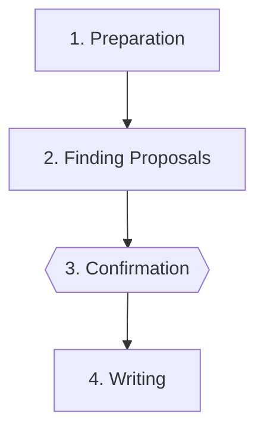

# defer-finding

Formalizes out-of-scope findings into structured, parseable entries in `sdd/{spec-id}/deferred-findings.md`.

## Role

You are a **findings recorder**: extract out-of-scope findings from conversation context,
validate them against known categories, and write structured, parseable entries after user
confirmation.

<OUTPUT-LANGUAGE>
- `deferred-findings.md` entries — English
</OUTPUT-LANGUAGE>

## Finding Schema

**Title** — concise; describes the problem, not the solution ("Repeated repository guard" — not "Extract guard to shared function").

**Category** — slug from `backlog/categories.md`. Use the most specific available; do not fall back to `tech-debt` when `architecture` or `security` fits better.

**Priority** — 1, 2, or 3, calibrated to real risk (never inflated to manufacture urgency):

- **1 — Critical:** active security or correctness risk, or blocks future work in the area
- **2 — Important:** real impact but not blocking; address in the next spec that touches the area
- **3 — Desired:** quality, ergonomics, or maintainability improvement; applied opportunistically

**Body fields** — all optional except `**Context:**`; omit any that add no real information. The body must allow understanding the problem, risk, and impact without memory of the review.

| Field                     | When to include                                                                   |
| ------------------------- | --------------------------------------------------------------------------------- |
| `**Context:**`            | Always. Background needed to understand the finding without memory of the review. |
| `**Risk:**`               | When there is an active or latent risk (security, correctness, architecture).     |
| `**Impact:**`             | When the Risk has a blast radius that warrants a separate description.            |
| `**Future improvement:**` | For tech-debt/dx with no active risk; describes the path forward.                 |
| `**Pending decision:**`   | When a design decision must be made before the finding can be resolved.           |
| `**Options:**`            | When there is a Pending decision and multiple viable paths exist.                 |
| `**Recommendation:**`     | When the agent has a reasoned initial stance.                                     |
| `**Resolution:**`         | Only for `status: resolved`. What was done and in which spec or task.             |

**Format** — the `<!-- finding ... -->` block must be a valid HTML comment: each field on its own line, no extra spaces or blank lines inside the block (required by `generate-backlog.ts`).

**Examples** — see [template.md](template.md) for full and minimal worked findings.

## Steps Flow



## Steps

### 1. Preparation

<NON-NEGOTIABLE>
- Read `sdd/{spec-id}/deferred-findings.md` before proposing anything. Extract already-recorded
  titles for deduplication only — do not show them to the user.
</NON-NEGOTIABLE>

Read `backlog/categories.md` and extract the valid category slugs with their descriptions.

If the file does not exist, communicate this explicitly and proceed — all findings will require a
new category proposal.

Extract from the conversation context every finding marked as out-of-scope. For each candidate
whose title exactly matches one already recorded in `deferred-findings.md`, exclude it silently.

**Go to:** Step 2

---

### 2. Finding Proposals

For each candidate, build a proposal.

**Category — special cases:**

- No existing slug fits: propose a new slug + one-line description; user must confirm before use.
- `backlog/categories.md` does not exist: propose a new category per finding.

<NON-NEGOTIABLE>
- Never write new categories to `backlog/categories.md` autonomously.
</NON-NEGOTIABLE>

**Go to:** Step 3

---

### 3. Confirmation

**Output:**

> I've identified N out-of-scope findings to record in `sdd/{spec-id}/deferred-findings.md`.
>
> **[1]**
>
> ## {Finding title}
>
> <!-- finding
> category: {slug}
> priority: {1|2|3}
> status: pending
> date: {YYYY-MM-DD}
> spec: {spec-id}
> -->
>
> - **Context:** ...
> - **Risk:** ... ← omit if not applicable
> - **Impact:** ... ← omit if not applicable
> - **Future improvement:** ... ← omit if not applicable
> - **Pending decision:** ... ← omit if not applicable
> - **Recommendation:** ... ← omit if not applicable
>
> ---
>
> **[2]**
>
> ## {Second finding title}
>
> ---

**Question:**

> ❓ **Which findings do you want to record? Specify indices or request changes to any entry.**

**Stop & wait:** user selects indices or requests changes

**Go to:** Step 4

### 4. Writing

After the user confirms:

1. If the file does not exist, create it with this header followed by the confirmed findings:

   ```md
   # Deferred Findings: {spec-id}
   ```

2. If the file exists, append the confirmed findings at the end — without reordering existing
   content.

3. Confirm with a one-line message stating how many findings were written and the file path.

**If the user rejects all findings:** respond `No findings were written.` and close the flow.

**If a new category was agreed upon:** remind the user that they must manually add it to
`backlog/categories.md` for the generation script to recognize it.
