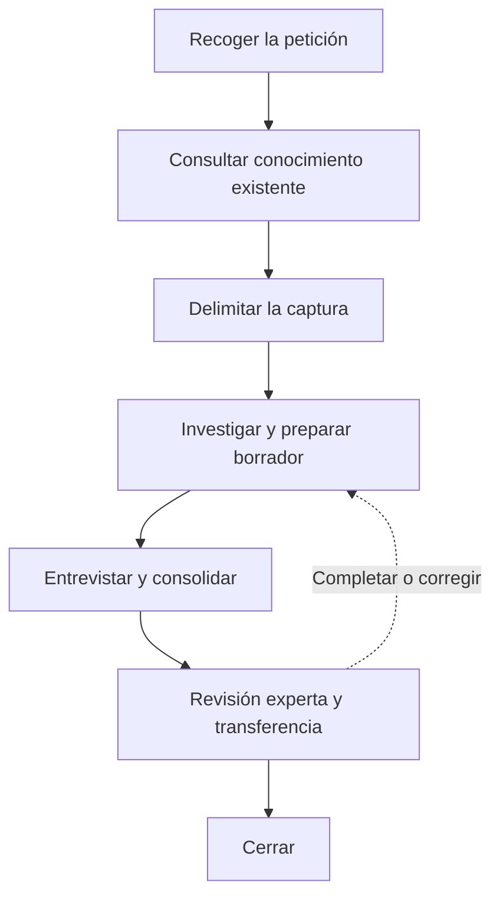

# DNA Harvest

Investigar un área y contrastar los hallazgos con el experto para crear o actualizar su conocimiento
funcional y técnico en `dna/`. El resultado debe servir a personas y agentes sin contexto previo.
Una tarea puede orientar la captura, pero lo documentado debe entenderse sin conocer dicha tarea.

## Principios

- Investigar el código antes de preguntar al experto. Preguntar sobre hallazgos concretos.
- Contrastar la documentación con el código investigado. Este acredita la implementación,
  no la corrección del negocio.
- Distinguir comportamiento observado, reglas esperadas y testimonio experto.
- Conservar el motivo y el ámbito de las reglas y excepciones. Declarar lo desconocido sin inventarlo.
- Acotar la captura y declarar su cobertura. En actualizaciones, revisar solo el contenido afectado.
- Claridad sobre volumen. Explicar cada concepto una vez y enlazarlo donde haga falta.
  Usar diagramas cuando aclaren y eliminar texto que no aporte información.

## Idioma

Escribir los documentos generados en español por defecto. Si el usuario indica otro idioma, usar ese.

- Conservar en inglés los términos habituales de la industria del software: endpoint, framework,
  deploy, rollback, etc.
- Mantener los nombres e identificadores del código sin traducir.

## Estructura

Crear o actualizar los artefactos en el repositorio del sistema investigado:

```text
dna/
|-- index.md                              # obligatorio
|-- deferred-findings.md
`-- domains/
    `-- <domain>/
        |-- index.md                      # obligatorio
        `-- <area>/
            |-- 00_harvest.md             # obligatorio
            |-- 01_about.md               # obligatorio
            |-- 02_vocabulary.md
            |-- 03_invariants.md
            |-- 04_flow-map.md            # obligatorio
            |-- 05_implementation-map.md  # obligatorio
            |-- 06_caveats.md
            `-- 07_unknowns.md
```

Crear `00_harvest.md` al iniciar la captura y los demás documentos obligatorios al preparar el
borrador. Crear los opcionales solo cuando tengan contenido.

En capturas parciales, indicar qué está documentado y qué queda sin explorar.

Los índices describen y enlazan el contenido existente sin duplicarlo. Conservar la organización y
el contenido ajenos al alcance.

## Estado y continuidad

`00_harvest.md` guarda el trabajo y el estado de la captura en su frontmatter `status`.
El estado afecta solo al alcance en curso; conserva las aprobaciones anteriores que sigan vigentes.

| Estado | Significado |
| --- | --- |
| `draft` | Investigación y borrador en preparación. |
| `pending-expert` | Faltan respuestas del experto o su consolidación. |
| `in-review` | Revisado por el agente; pendiente de aprobación experta. |
| `validated` | El experto ha aprobado explícitamente el contenido y su alcance. |

- Recorrido habitual: `draft` → `pending-expert` → `in-review` → `validated`.
- Sin preguntas al experto, pasar de `draft` a `in-review`.
- Si hace falta investigar, volver a `draft`; si solo falta aclaración experta, a `pending-expert`.
  Las correcciones de redacción pueden permanecer en `in-review`.
- Reabrir una captura validada solo por un alcance nuevo o una corrección identificada.
- Cerrar la sesión no cambia el estado. Registrar la transferencia por separado.

Al retomar, leer `00_harvest.md` y sus documentos enlazados. Continuar desde el próximo paso
registrado. Reinvestigar solo ante cambios en las fuentes, nuevas pistas o evidencia insuficiente.

Mantener alcance, investigación, hallazgos pendientes, preguntas, revisión y próximo paso.
Actualizar al cambiar de estado y antes de cerrar o interrumpir la sesión.

Sustituir los hallazgos consolidados por enlaces a su documento definitivo. Trabajar aquí las
preguntas de la captura y trasladar a `07_unknowns.md` las incógnitas que permanezcan en la entrega.
No transcribir conversaciones ni registrar cada búsqueda.

## Hallazgos fuera de alcance

`dna/deferred-findings.md` recoge dos casos:

- Hallazgos importantes que quedan fuera del alcance actual y necesitan atención, aunque atenderlos
  no consista en documentar.
- Conocimiento importante para el dominio actual que debe documentarse, pero queda fuera del alcance
  de esta captura. Explicar por qué es relevante y necesita documentación.

Crear el archivo con el primer hallazgo y enlazarlo desde `dna/index.md`. Cada entrada explica qué
se encontró, dónde, sus referencias, por qué importa y por qué queda fuera del alcance. Reutilizar
entradas existentes; registrarlas no implica resolverlas en esta captura.

Guardar cada tipo de información en su archivo:

- `00_harvest.md`: trabajo y preguntas de la captura actual.
- `07_unknowns.md`: dudas o contradicciones que siguen abiertas en la documentación entregada.
- `deferred-findings.md`: hallazgos importantes fuera del alcance actual que requieren atención o
  documentación.

No usar el archivo como historial ni como lista de todo lo que falta explorar.

## Reglas de contenido y evidencia

- Explicar significado funcional, entradas, condiciones, resultados, supuestos y efectos relevantes.
  Enlazar el código que se explica por sí mismo, sin narrarlo línea a línea.
- Omitir introducciones genéricas, resúmenes repetidos y secciones vacías.
- Relacionar el vocabulario del negocio con tipos, tablas e interfaz para establecer el lenguaje ubicuo.
- Documentar secuencias y comportamiento en `flow-map`; código, acoplamientos e impacto en
  `implementation-map`. Enlazar lo compartido.
- Usar diagramas ASCII en bloques `text` cuando aclaren. Etiquetar llamadas, eventos y datos
  compartidos, distinguiendo relaciones verificadas de inferidas.
- Indicar la procedencia junto a cada afirmación no evidente o al bloque que respalda:
  - Código: ruta y símbolo, test, tabla o contrato.
  - Experto: identidad o rol y fecha.
  - Incidente: referencia verificable.
  - Decisión: ADR o explicación atribuida.
  - Normativa: fuente aplicable y vigencia. Si solo hay testimonio experto, atribuirlo
    y dejar pendiente la verificación normativa.
- Declarar qué se ha comprobado y sus límites. Los tests respaldan solo los casos que ejercitan;
  la lectura estática no demuestra ejecución en producción ni ausencia de consumidores externos.
  Considerar los datos, la configuración y la versión desplegada.
- Mantener explícitas las discrepancias entre código y reglas de negocio. Registrar lo irresuelto
  en `07_unknowns.md`.

## Templates

Leer solo las plantillas necesarias de los artefactos que se van a crear o modificar. Sustituir las indicaciones entre llaves por contenido comprobado
y eliminar las instrucciones del resultado.

- Índice global: [templates/root-index.md](templates/root-index.md) genera `dna/index.md`,
  que enumera los dominios documentados y enlaza sus índices.
- Índice de dominio: [templates/domain-index.md](templates/domain-index.md) genera
  `dna/domains/<domain>/index.md`, que describe el propósito y los límites del dominio y enlaza
  el `01_about.md` de cada área documentada.
- Hallazgos fuera de alcance: [templates/deferred-findings.md](templates/deferred-findings.md) genera `dna/deferred-findings.md`.
- Trabajo y estado de la captura: [templates/00_harvest.md](templates/00_harvest.md).
- Descripción del área: [templates/01_about.md](templates/01_about.md).
- Lenguaje ubicuo: [templates/02_vocabulary.md](templates/02_vocabulary.md).
- Invariantes: [templates/03_invariants.md](templates/03_invariants.md).
- Flujos: [templates/04_flow-map.md](templates/04_flow-map.md).
- Implementación e impacto: [templates/05_implementation-map.md](templates/05_implementation-map.md).
- Caveats: [templates/06_caveats.md](templates/06_caveats.md).
- Desconocidos: [templates/07_unknowns.md](templates/07_unknowns.md).

## Flujo



El diagrama agrupa las fases y resume los retornos en una sola flecha. Desde la entrevista,
consolidación, revisión experta o transferencia, volver solo al paso necesario:

- Investigar si falta evidencia técnica.
- Entrevistar si falta una aclaración del experto.
- Consolidar si basta con incorporar correcciones.

## Pasos

### 1. Recoger la petición

Trabajar por defecto en el repositorio desde el que se invoca.

Hay dos tipos de captura: directa, para documentar un área o tema, y a partir de una tarea, cuando un ticket o explicación sirve de punto de partida.

- Determina el tipo de captura con la información disponible:
  - Si el usuario aporta un ticket de Jira o explica una tarea, trata la petición como una captura a partir de una tarea.
  - Si el usuario indica un dominio, un área o que quiere documentar un tema, trátala como una captura para documentar.
  - Si no hay información suficiente, pregunta qué quiere hacer. Después, pide solo los datos que falten.

- Si se quiere documentar un tema:
  - Recoge el dominio o área y el tema que se quiere explicar.
  - Usa el directorio, archivo de código o contexto adicional que aporte el usuario.

- Si la captura parte de una tarea:
  - Recoge el ticket de Jira o la explicación de la tarea.
  - Identifica el problema, el comportamiento focal y los ejemplos disponibles.
  - No adelantes el diseño ni propongas una solución.
  - Si no puedes acceder al ticket, pide su contenido.
  - Trata el directorio o archivo de código, el dominio o área y el contexto adicional como datos opcionales.

- En ambos casos:
  - Define qué debe explicar la captura y qué debe poder hacer el receptor con ese conocimiento.
  - No repitas datos ya proporcionados ni conviertas la entrada en un cuestionario.
  - Localiza la ruta de código si no se ha indicado.
  - Identifica de forma provisional el dominio, el área y el tema para consultar el conocimiento existente.
  - Si alguno no está claro, usa la información de la petición y una exploración inicial para localizarlo.
  - Pregunta solo si no puedes identificarlo con esa información.

### 2. Consultar el conocimiento existente

Muestra al usuario este mensaje antes de buscar: `🧐 Consultando conocimiento existente en dna/`.

Consulta los índices DNA de `dna/`, el índice global y el índice del dominio. Incluye la captura
previa y los hallazgos fuera de alcance, si existen. No abras los documentos encontrados de forma
automática.

Cuando encuentres documentos que parezcan relevantes:

- Indica su ruta y por qué pueden aportar contexto.
- Pregunta al usuario cuáles quiere que leas.
- Lee solo los documentos que confirme.

Con lo leído, determina si el tema ya está documentado, debe ampliarse o requiere una captura nueva.
No dupliques conocimiento. Actualiza o amplía el documento existente cuando ya cubra parte del tema.
Mantén presentes los hechos, reglas, anclas y pendientes relevantes durante la captura.

Si no hay documentación relacionada, trata la petición como una captura inicial. Si hay indicios de
duplicación y el usuario no quiere abrir los documentos relacionados, explica el riesgo y su motivo.
Si vuelve a rechazarlo, continúa sin abrirlos y mantén visible esa limitación durante la captura.

### 3. Delimitar la captura

Muestra al usuario este mensaje antes de empezar:

```text
🎯 Ahora vamos a delimitar el dominio y el área de la captura.
- Dominio: parte del negocio con propósito, vocabulario, reglas y límites propios.
- Área: parte concreta del dominio donde vive el conocimiento que se documenta.
```

Con la información de los pasos anteriores, prepara una propuesta:

- Dominio y área. Reutiliza los nombres existentes. Si hace falta uno nuevo, indícalo.
- Tema y cobertura: qué se documentará y qué quedará fuera. Una captura puede cubrir un área
  completa o un flujo concreto.
- Tipo de captura: nueva, ampliación de una existente o actualización de una parte.
- Contexto necesario para explicar el tema, sin dependencias que no aporten a ese objetivo.

Presenta la propuesta y pide al usuario el ok explícito a tres cosas: dominio, área y línea de
trabajo (tema, cobertura y tipo de captura). Espera siempre su confirmación:

- Si corrige algo, ajusta la propuesta y vuelve a pedir el ok.
- No escribas en `dna/` hasta tener las tres confirmadas.

Con el ok:

- Captura nueva: crea `00_harvest.md` con la [plantilla](templates/00_harvest.md), frontmatter
  `status: draft` y las secciones `Alcance`, `Resultado esperado` y `Próximo paso`.
- Captura existente: sigue su continuidad y actualiza el alcance si cambia.
- Hallazgos fuera de alcance: sigue la sección
  [Hallazgos fuera de alcance](#hallazgos-fuera-de-alcance).

### 4. Investigar el sistema

Leer código, tests, formularios, APIs, procesos, eventos, esquemas y configuración pertinentes.

Usa un intervalo de líneas solo como punto de entrada. En archivos grandes, localiza símbolos o
bloques funcionales y lee los tramos necesarios. En métodos monolíticos, identifica operaciones,
condiciones y flujo de control. No cargues archivos completos por defecto ni ignores dependencias
solo porque estén fuera del intervalo inicial.

- Derivar el vocabulario desde tipos, tablas, campos y etiquetas de interfaz.
- Seguir quién prepara las entradas, qué condiciones activan el bloque y qué dependencias utiliza.
- Seguir resultados y consumidores, lecturas y escrituras, variables compartidas, acumulados,
  tablas, cachés y configuración que condicionen el comportamiento.
- Identificar ordenamientos, jobs, concurrencia, límites transaccionales y estado ante fallos.
  Buscar conexiones por datos y orden temporal, además de llamadas directas.
- Identificar casos límite y posibles regresiones con su mecanismo y evidencia. Describir el
  impacto condicionado al tipo de cambio, sin presentar un inventario exhaustivo ni afirmar el
  impacto definitivo de una modificación aún no diseñada.
- Localizar tests y puntos de diagnóstico que protejan o permitan observar el comportamiento.
- Registrar las anclas encontradas y las limitaciones de la investigación.

Registrar en `00_harvest.md` la fecha de investigación y la revisión del código consultada, si está
disponible. Si hay cambios locales relevantes, indicarlo: el commit por sí solo no identifica todo
el código investigado. En actualizaciones parciales, asociar esta referencia al alcance revisado.

Buscar tanto consumidores como proveedores. Una referencia ausente no prueba que el código esté
muerto: considerar configuración, ejecución dinámica e integraciones no disponibles.

Por cada conexión relevante, profundizar si puede cambiar la interpretación del comportamiento;
documentar su contrato si basta para entenderla; o declarar una frontera no verificada cuando falte
evidencia. No imponer un número fijo de saltos ni recorrer todo el sistema por transitividad.
Aplicar también a las nuevas conexiones la delimitación acordada: registrar en `dna/deferred-findings.md`
los hallazgos y necesidades de documentación que cumplan los criterios de «Hallazgos fuera de
alcance», conservando aquí el contrato o la frontera necesarios para comprender el recorrido actual.
Detener la investigación cuando se puedan explicar el recorrido focal, sus condiciones, entradas,
salidas y conexiones relevantes, y estén identificadas las limitaciones restantes. Un hueco que
impida comprender ese recorrido exige evidencia adicional o debe declararse bloqueante para las
decisiones que dependan de él; no exige investigar indefinidamente.

En actualizaciones, verificar el contenido afectado y sus relaciones, conservando el resto.

### 5. Preparar el borrador y detectar huecos

Crear o actualizar los documentos aplicables con la evidencia disponible. Indicar en `01_about.md`
la cobertura y lo que queda sin explorar. Mantener navegables los índices global y de dominio.

Marcar el contenido nuevo o modificado pendiente de revisión junto al bloque o documento
correspondiente. Conservar las validaciones anteriores únicamente para el contenido que siga siendo
válido y no esté afectado por el cambio. En `00_harvest.md`, distinguir el alcance aprobado del
pendiente, tanto para la revisión experta como para la transferencia. Enlazar ese estado desde
`01_about.md`, que conserva la descripción, cobertura y navegación del área. Una actualización parcial no
renueva la validación de toda el área.

Buscar ganchos para la entrevista: literales especiales, excepciones por cliente, comentarios de
advertencia, errores ignorados, órdenes implícitos, escrituras compartidas y contradicciones.
Priorizar preguntas por impacto y por lo que impide comprender el flujo. No convertir cada detalle
técnico en una pregunta al experto. Guardar las preguntas en `00_harvest.md` con contexto y ancla
suficientes para retomarlas en otra sesión. Cuando estén preparadas, usar `pending-expert`.
Si no hay preguntas, continuar con la consolidación y revisión del agente.

### 6. Entrevistar al experto

Formular una pregunta por mensaje y esperar la respuesta. Presentar el hallazgo y su ancla con el
contexto mínimo necesario. Validar primero el recorrido funcional y profundizar en motivos,
invariantes, excepciones y diagnóstico.

Cuando ayude a explicar un riesgo, preguntar por un incidente real: qué ocurrió, qué señal permitió
detectarlo, qué se descartó y qué habría interpretado mal alguien nuevo. También preguntar por
dependencias operativas que no aparecen en el código, como preparación manual, correcciones de
datos o integraciones fuera del recorrido investigado. No limitar la entrevista a rarezas visibles.

Contrastar las respuestas con las fuentes disponibles. Si contradicen el código, distinguir lo que
debería ocurrir de lo que ocurre y pedir aclaración. Si una respuesta descubre otra ruta o
dependencia que condiciona el recorrido acordado, volver a investigar y actualizar los mapas antes
de continuar. Registrar en `dna/deferred-findings.md` los hallazgos importantes y necesidades de documentación
fuera de alcance que cumplan sus criterios.
Separar explicaciones del estado actual, reglas esperadas vigentes y deseos para el cambio futuro.
Trasladar estos últimos al contexto de la especificación, sin publicarlos como verdad actual en DNA.
No corregir código durante la captura.

Cerrar la entrevista cuando los huecos relevantes estén respondidos o reconocidos como desconocidos.
Registrar las respuestas con su procedencia en `00_harvest.md` hasta incorporarlas al conocimiento.
Si no hay experto disponible y faltan respuestas, conservar `pending-expert` y cerrar la sesión con
las preguntas y el próximo paso registrados. En actualizaciones sin dudas para el experto, omitir
esta entrevista.

### 7. Consolidar y realizar self-review

Incorporar respuestas con su procedencia. Sustituir los hallazgos ya consolidados de `00_harvest.md`
por enlaces a su destino. Trasladar a `07_unknowns.md` las incógnitas relevantes que permanecerán
abiertas en la entrega, sin mantener dos copias. Revisar:

- Cobertura explícita y coherencia entre descripción, vocabulario, reglas y mapas.
- Separación entre hechos observados, expectativas y testimonios.
- Motivo y ámbito de reglas y excepciones relevantes.
- Anclas resolubles y evidencia suficiente para las afirmaciones técnicas.
- Conexiones por llamadas, datos y orden temporal respaldadas, con fronteras no verificadas visibles.
- Impacto condicionado al cambio y acompañado de comprobaciones concretas, distinguiendo tests
  existentes de verificaciones propuestas, sin inventar garantías.
- Diagramas coherentes con las fuentes y enlaces internos navegables.
- Ausencia de duplicación, relleno, placeholders y enlaces a SDD.

Corregir fallos demostrables. Volver a la entrevista si queda una contradicción que requiere
conocimiento experto. Los desconocidos reconocidos no obligan a una investigación ilimitada.
Al quedar el contenido listo para revisión experta, establecer `in-review` en `00_harvest.md`.

### 8. Solicitar revisión experta y resolver findings

Presentar documentos modificados, alcance, diff cuando esté disponible y pendientes. Si hay experto
disponible, pedir que revise exactitud, motivos e impacto y esperar su respuesta. Si no está
disponible, conservar `in-review` y pasar al cierre con la aprobación pendiente en `00_harvest.md`.
Al retomar la sesión, comprobar si han cambiado las fuentes antes de continuar la revisión.

Analizar cada finding con el usuario: aplicar si está respaldado; rechazar con explicación si es
incorrecto; registrar como desconocido si no puede resolverse. Revisar de nuevo las partes cambiadas
y pedir confirmación sobre ellas. No atribuir al experto una validación que no haya dado.

Registrar en `00_harvest.md` quién revisó, cuándo y qué alcance aprobó. Establecer `validated` solo
tras aprobación explícita; mantener visibles los desconocidos aceptados y el alcance no aprobado.
En una corrección puramente mecánica de referencias,
comprobar las anclas sin exigir una nueva validación funcional.

### 9. Validar la transferencia

Registrar el caso y resultado de transferencia en `00_harvest.md`, separado del estado de revisión.
En una captura inicial, proponer un caso realista dentro del alcance para una persona sin contexto.
Pedir que use DNA para seguir el flujo, localizar la implementación, reconocer reglas, anticipar
impacto y proponer pruebas o diagnóstico. El agente prepara el caso; el receptor aporta el resultado.

Corregir los huecos que revele la prueba. Devolver al experto los cambios que alteren afirmaciones
funcionales. Si no hay receptor disponible, indicar que la transferencia queda pendiente; no
equiparar la self-review del agente con esta prueba.

En actualizaciones, repetirla cuando cambien sustancialmente flujos, reglas o impacto. Una revisión
parcial no valida todo el área. No repetir la prueba por cada ticket ni convertir la disponibilidad
de un receptor en requisito para empezar una especificación; valorar por separado la suficiencia
del contexto para esa tarea.

### 10. Cerrar

Comprobar los archivos finales y resumir rutas, cobertura, revisión experta y resultado de
transferencia, señalando los pendientes. Dejar actualizado `00_harvest.md` con su estado y próximo
paso. Cada pregunta queda resuelta e incorporada, trasladada a `07_unknowns.md` o descartada con un
motivo breve; si la sesión se interrumpe, las preguntas por contestar permanecen pendientes.
Conservar el documento para retomar la captura, sin convertirlo en un historial de conversaciones.
No declarar completadas validaciones no realizadas.

Revisar las entradas de `dna/deferred-findings.md` afectadas por la captura: retirar las resueltas o documentadas
y conservar lo pendiente con sus anclas y contexto para retomarlo. Resumir los hallazgos diferidos en la
entrega y comprobar el enlace desde el índice global si el archivo existe.

Si la captura prepara una tarea, informar en el cierre si hay contexto suficiente para `sdd-spec`:

- El problema está localizado y el comportamiento actual tiene evidencia.
- Se conocen las entradas, salidas y conexiones que condicionan la tarea.
- Las discrepancias relevantes están resueltas o identificadas, y los desconocidos restantes no
  impiden formular los requisitos ni decidir el comportamiento que dependa de ellos.

Cerrar una sesión con un borrador no acredita esa suficiencia. Indicar qué decisión impide cada
hueco bloqueante y cómo aclararlo. Los pendientes ajenos a la tarea no bloquean su especificación.
Esta valoración depende de la tarea: comunicarla en la entrega, sin convertir DNA en un registro de
tickets. Enlazar el conocimiento y sus pendientes para que `sdd-spec` pueda consultarlos. No ejecutar
`sdd-spec` automáticamente.

Si la especificación descubre una carencia relevante, ampliar la captura afectada. Tras implementar
y verificar un cambio, revisar si ha invalidado el conocimiento documentado y actualizar solo lo
afectado contra el código resultante. Una propuesta aprobada no demuestra comportamiento implementado.

Si procede un commit autorizado, incluir únicamente los cambios DNA de la sesión y usar:

```text
docs(dna): document {domain}/{area}
```

Para una actualización:

```text
docs(dna): update {domain}/{area}
```

No crear commits vacíos ni hacer push como parte de la captura.
