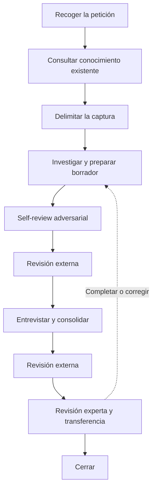

# DNA Harvest

Investigar un área y contrastar los hallazgos con el experto para crear o actualizar su conocimiento
funcional y técnico en `dna/`. El resultado debe servir a personas y agentes sin contexto previo.
Una tarea puede orientar la captura, pero lo documentado debe entenderse sin conocer dicha tarea.

## Principios

- Investigar el código antes de preguntar al experto. Preguntar sobre hallazgos concretos.
- Contrastar la documentación con el código investigado. Este acredita la implementación,
  no la corrección del negocio.
- Distinguir comportamiento observado, reglas esperadas y testimonio experto.
- Conservar el motivo y el ámbito de las reglas y excepciones. Declarar lo desconocido sin inventarlo.
- Acotar la captura y declarar su cobertura. En actualizaciones, revisar solo el contenido afectado.
- No corregir código durante la captura.
- Claridad sobre volumen, según [Redacción](#redacción).

## Idioma

Escribir los documentos generados en español por defecto. Si el usuario indica otro idioma, usar ese.

- Conservar en inglés los términos habituales de la industria del software: endpoint, framework,
  deploy, rollback, etc.
- Mantener los nombres e identificadores del código sin traducir.

## Redacción

Escribir claro y sencillo. El criterio es la información, no la longitud:

- Cada frase aporta un hecho, una regla, un motivo, un ancla o un límite. Si al quitarla no se
  pierde nada, quitarla.
- Sin introducciones, resúmenes, repeticiones ni relleno. Lo ya explicado se enlaza.
- Recortar nunca justifica omitir. Conservar siempre hechos, reglas con su motivo y ámbito,
  excepciones, anclas, procedencia, discrepancias y limitaciones.
- Ante la duda entre acortar o perder información, conservar la información y simplificar la
  redacción.
- Usar diagramas cuando aclaren.

## Estructura

Crear o actualizar los artefactos en el repositorio del sistema investigado:

```text
dna/
|-- index.md                              # obligatorio
|-- deferred-findings.md
`-- domains/
    `-- <domain>/
        |-- index.md                      # obligatorio
        `-- <area>/
            |-- 00_harvest.md             # obligatorio
            |-- 01_about.md               # obligatorio
            |-- 02_vocabulary.md
            |-- 03_invariants.md
            |-- 04_flow-map.md            # obligatorio
            |-- 05_implementation-map.md  # obligatorio
            |-- 06_caveats.md
            `-- 07_unknowns.md
```

En capturas parciales, indicar qué está documentado y qué queda sin explorar.

Los índices describen y enlazan el contenido existente sin duplicarlo. Conservar la organización y
el contenido ajenos al alcance.

## Documentos del área

Cada dato va al archivo que le corresponde. Los opcionales solo se crean con contenido relevante;
nunca vacíos. El último es global y sigue [Hallazgos fuera de alcance](#hallazgos-fuera-de-alcance).

| Archivo                    | Contenido                                              | Cuándo             |
| -------------------------- | ------------------------------------------------------ | ------------------ |
| `01_about.md`              | Propósito, límites, cobertura y qué queda sin explorar | Siempre            |
| `04_flow-map.md`           | Flujos, estados, orden y excepciones                   | Siempre            |
| `05_implementation-map.md` | Anclas, dependencias, impacto y qué verificar          | Siempre            |
| `02_vocabulary.md`         | Términos del negocio y su representación en código     | Solo con contenido |
| `03_invariants.md`         | Reglas que deben cumplirse, motivo y ámbito            | Solo con contenido |
| `06_caveats.md`            | Comportamientos contraintuitivos y diagnóstico         | Solo con contenido |
| `07_unknowns.md`           | Dudas que quedarán abiertas en la entrega              | Solo con contenido |
| `dna/deferred-findings.md` | Hallazgos importantes fuera del alcance (global)       | Solo con contenido |

## Estado y continuidad

`00_harvest.md` guarda el trabajo y el estado de la captura en su frontmatter `status`.
El estado afecta solo al alcance en curso; conserva las aprobaciones anteriores que sigan vigentes.

| Estado | Significado |
| --- | --- |
| `draft` | Investigación y borrador en preparación. |
| `pending-expert` | Faltan respuestas del experto o su consolidación. |
| `in-review` | Revisado por el agente; pendiente de aprobación experta. |
| `validated` | El experto ha aprobado explícitamente el contenido y su alcance. |

- Recorrido habitual: `draft` → `pending-expert` → `in-review` → `validated`.
- Sin preguntas al experto, pasar de `draft` a `in-review`.
- Si hace falta investigar, volver a `draft`; si solo falta aclaración experta, a `pending-expert`.
  Las correcciones de redacción pueden permanecer en `in-review`.
- Reabrir una captura validada solo por un alcance nuevo o una corrección identificada.
- Cerrar la sesión no cambia el estado. Registrar la transferencia por separado.

Al retomar, leer `00_harvest.md` y sus documentos enlazados. Continuar desde el próximo paso
registrado. Reinvestigar solo ante cambios en las fuentes, nuevas pistas o evidencia insuficiente.

Mantener alcance, investigación, hallazgos pendientes, preguntas, revisión y próximo paso.
Actualizar al cambiar de estado y antes de cerrar o interrumpir la sesión.

Sustituir los hallazgos consolidados por enlaces a su documento definitivo. Trabajar aquí las
preguntas de la captura y trasladar a `07_unknowns.md` las incógnitas que permanezcan en la entrega.
No transcribir conversaciones ni registrar cada búsqueda.

## Hallazgos fuera de alcance

`dna/deferred-findings.md` recoge tres casos:

- Hallazgos importantes que quedan fuera del alcance actual y necesitan atención, aunque atenderlos
  no consista en documentar. Incluye los defectos confirmados por el experto.
- Conocimiento importante para el dominio actual que debe documentarse, pero queda fuera del alcance
  de esta captura. Explicar por qué es relevante y necesita documentación.
- Propuestas de cambio del experto: reglas que deberían cumplirse o comportamientos que deberían
  cambiar y aún no están vigentes. No son verdad actual y no entran en los documentos del área.
  Registrar quién lo propone y cuándo. Las ideas sueltas no se registran.

Crear el archivo con el primer hallazgo y enlazarlo desde `dna/index.md`. Cada entrada explica qué
se encontró, dónde, sus referencias, por qué importa y por qué queda fuera del alcance. Reutilizar
entradas existentes; registrarlas no implica resolverlas en esta captura.

Guardar cada tipo de información en su archivo:

- `00_harvest.md`: trabajo y preguntas de la captura actual.
- `07_unknowns.md`: dudas o contradicciones que siguen abiertas en la documentación entregada.
- `deferred-findings.md`: hallazgos importantes fuera del alcance actual que requieren atención o
  documentación, y propuestas de cambio.

No usar el archivo como historial ni como lista de todo lo que falta explorar.

## Reglas de contenido y evidencia

- Explicar significado funcional, entradas, condiciones, resultados, supuestos y efectos relevantes.
  Enlazar el código que se explica por sí mismo, sin narrarlo línea a línea.
- Relacionar el vocabulario del negocio con tipos, tablas e interfaz para establecer el lenguaje ubicuo.
- Documentar secuencias y comportamiento en `flow-map`; código, acoplamientos e impacto en
  `implementation-map`. Enlazar lo compartido.
- Usar diagramas ASCII en bloques `text` cuando aclaren. Etiquetar llamadas, eventos y datos
  compartidos, distinguiendo relaciones verificadas de inferidas.
- Indicar la procedencia junto a cada afirmación no evidente o al bloque que respalda:
  - Código: ruta y símbolo, test, tabla o contrato.
  - Experto: identidad o rol y fecha.
  - Incidente: referencia verificable.
  - Decisión: ADR o explicación atribuida.
  - Normativa: fuente aplicable y vigencia. Si solo hay testimonio experto, atribuirlo
    y dejar pendiente la verificación normativa.
- Declarar qué se ha comprobado y sus límites. Los tests respaldan solo los casos que ejercitan;
  la lectura estática no demuestra ejecución en producción ni ausencia de consumidores externos.
  Considerar los datos, la configuración y la versión desplegada.
- Mantener explícitas las discrepancias entre código y reglas de negocio. Registrar lo irresuelto
  en `07_unknowns.md`.

## Templates

Leer solo las plantillas necesarias de los artefactos que se van a crear o modificar. Sustituir las indicaciones entre llaves por contenido comprobado
y eliminar las instrucciones del resultado.

- Índice global: [templates/root-index.md](templates/root-index.md) genera `dna/index.md`,
  que enumera los dominios documentados y enlaza sus índices.
- Índice de dominio: [templates/domain-index.md](templates/domain-index.md) genera
  `dna/domains/<domain>/index.md`, que describe el propósito y los límites del dominio y enlaza
  el `01_about.md` de cada área documentada.
- Hallazgos fuera de alcance: [templates/deferred-findings.md](templates/deferred-findings.md) genera `dna/deferred-findings.md`.
- Trabajo y estado de la captura: [templates/00_harvest.md](templates/00_harvest.md).
- Descripción del área: [templates/01_about.md](templates/01_about.md).
- Lenguaje ubicuo: [templates/02_vocabulary.md](templates/02_vocabulary.md).
- Invariantes: [templates/03_invariants.md](templates/03_invariants.md).
- Flujos: [templates/04_flow-map.md](templates/04_flow-map.md).
- Implementación e impacto: [templates/05_implementation-map.md](templates/05_implementation-map.md).
- Caveats: [templates/06_caveats.md](templates/06_caveats.md).
- Desconocidos: [templates/07_unknowns.md](templates/07_unknowns.md).

## Flujo



El diagrama agrupa las fases y resume los retornos en una sola flecha. Desde el self-review, la
revisión externa, la entrevista, la consolidación, la revisión experta o la transferencia, volver
solo al paso necesario:

- Investigar si falta evidencia técnica.
- Entrevistar si falta una aclaración del experto.
- Consolidar si basta con incorporar correcciones.

## Pasos

### 1. Recoger la petición

Trabajar por defecto en el repositorio desde el que se invoca.

Hay dos tipos de captura: directa, para documentar un área o tema, y a partir de una tarea, cuando un ticket o explicación sirve de punto de partida.

- Determina el tipo de captura con la información disponible:
  - Si el usuario aporta un ticket de Jira o explica una tarea, trata la petición como una captura a partir de una tarea.
  - Si el usuario indica un dominio, un área o que quiere documentar un tema, trátala como una captura para documentar.
  - Si no hay información suficiente, pregunta qué quiere hacer. Después, pide solo los datos que falten.

- Si se quiere documentar un tema:
  - Recoge el dominio o área y el tema que se quiere explicar.
  - Usa el directorio, archivo de código o contexto adicional que aporte el usuario.

- Si la captura parte de una tarea:
  - Recoge el ticket de Jira o la explicación de la tarea.
  - Identifica el problema, el comportamiento focal y los ejemplos disponibles.
  - No adelantes el diseño ni propongas una solución.
  - Si no puedes acceder al ticket, pide su contenido.
  - Trata el directorio o archivo de código, el dominio o área y el contexto adicional como datos opcionales.

- En ambos casos:
  - Define qué debe explicar la captura y qué debe poder hacer el receptor con ese conocimiento.
  - No repitas datos ya proporcionados ni conviertas la entrada en un cuestionario.
  - Localiza la ruta de código si no se ha indicado.
  - El código que aporte el usuario (directorio, archivo o líneas) es un punto de partida, no un
    límite. Explora las conexiones que hagan falta para explicar el tema.
  - Identifica de forma provisional el dominio, el área y el tema para consultar el conocimiento existente.
  - Si alguno no está claro, usa la información de la petición y una exploración inicial para localizarlo.
  - Pregunta solo si no puedes identificarlo con esa información.

### 2. Consultar el conocimiento existente

Muestra al usuario este mensaje antes de buscar:

🧐 Consultando conocimiento existente en dna/

Consulta los índices DNA de `dna/`, el índice global y el índice del dominio. Incluye la captura
previa y los hallazgos fuera de alcance, si existen. No abras los documentos encontrados de forma
automática.

Cuando encuentres documentos que parezcan relevantes:

- Indica su ruta y por qué pueden aportar contexto.
- Pregunta al usuario cuáles quiere que leas.
- Lee solo los documentos que confirme.

Con lo leído, determina si el tema ya está documentado, debe ampliarse o requiere una captura nueva.
No dupliques conocimiento. Actualiza o amplía el documento existente cuando ya cubra parte del tema.
Mantén presentes los hechos, reglas, anclas y pendientes relevantes durante la captura.

Si no hay documentación relacionada, trata la petición como una captura inicial. Si hay indicios de
duplicación y el usuario no quiere abrir los documentos relacionados, explica el riesgo y su motivo.
Si vuelve a rechazarlo, continúa sin abrirlos y mantén visible esa limitación durante la captura.

### 3. Delimitar la captura

Muestra al usuario este mensaje antes de empezar:

🎯 Ahora vamos a delimitar el dominio y el área de la captura.
- Dominio: parte del negocio con propósito, vocabulario, reglas y límites propios.
- Área: parte concreta del dominio donde vive el conocimiento que se documenta.

Con la información de los pasos anteriores, prepara una propuesta:

- Dominio y área. Reutiliza los nombres existentes. Si hace falta uno nuevo, indícalo.
- Tema y cobertura: qué se documentará y qué quedará fuera. Una captura puede cubrir un área
  completa o un flujo concreto.
- Tipo de captura: nueva, ampliación de una existente o actualización de una parte.
- Contexto necesario para explicar el tema, sin dependencias que no aporten a ese objetivo.

Presenta la propuesta y pide al usuario el ok explícito a tres cosas: dominio, área y línea de
trabajo (tema, cobertura y tipo de captura). Espera siempre su confirmación:

- Si corrige algo, ajusta la propuesta y vuelve a pedir el ok.
- No escribas en `dna/` hasta tener las tres confirmadas.

Con el ok:

- Captura nueva: crea `00_harvest.md` con la [plantilla](templates/00_harvest.md), frontmatter
  `status: draft` y las secciones `Alcance`, `Resultado esperado` y `Próximo paso`.
- Captura existente: sigue su continuidad y actualiza el alcance si cambia.
- Hallazgos fuera de alcance: sigue la sección
  [Hallazgos fuera de alcance](#hallazgos-fuera-de-alcance).

### 4. Investigar el sistema

Muestra al usuario este mensaje antes de empezar:

🔬 Investigando el sistema

Fuentes a consultar:

- Código aportado y sus dependencias.
- Tests, formularios, APIs, procesos, eventos, esquemas y configuración pertinentes.
- Documentación existente, si la hay: `docs/`, `adr/`, README y comentarios del código. Contrástala
  con el código; documenta las discrepancias.

Cómo leer:

- En archivos grandes, localiza símbolos o bloques funcionales y lee solo los tramos necesarios.
- En métodos monolíticos, identifica operaciones, condiciones y flujo de control.
- No cargues archivos completos por defecto.

Qué seguir:

- Vocabulario: tipos, tablas, campos y etiquetas de interfaz.
- Entradas: quién las prepara, qué condiciones activan el bloque y qué dependencias usa.
- Salidas: resultados, consumidores, lecturas y escrituras, estado compartido, cachés.
- Configuración por entorno o cliente que condicione el comportamiento.
- Orden temporal: jobs, concurrencia, límites transaccionales y estado ante fallos.
- Casos límite y posibles regresiones, con su mecanismo y evidencia.
- Tests y puntos de diagnóstico que protejan u observen el comportamiento.
- Ganchos para la entrevista: literales especiales, excepciones por cliente, comentarios de
  advertencia, errores ignorados, órdenes implícitos y contradicciones. Anótalos para el paso 5.

Busca consumidores y proveedores. Una referencia ausente no prueba código muerto: considera
configuración, ejecución dinámica e integraciones no disponibles.

Por cada conexión relevante, elige una opción:

- Profundizar, si puede cambiar la interpretación del comportamiento.
- Documentar su contrato, si basta para entenderla.
- Declarar frontera no verificada, si falta evidencia.
- Si queda fuera del alcance acordado, sigue [Hallazgos fuera de alcance](#hallazgos-fuera-de-alcance)
  y conserva aquí solo el contrato o la frontera.

Cuándo parar:

- Puedes explicar el recorrido focal: condiciones, entradas, salidas y conexiones relevantes.
- Las limitaciones restantes están identificadas.
- No impongas un número fijo de saltos ni recorras todo el sistema.
- Un hueco que impida entender el recorrido exige más evidencia o se declara bloqueante para las
  decisiones que dependan de él. No investigues indefinidamente.

Registra en `00_harvest.md`, sección `Investigación realizada`:

- Fecha y revisión del código consultada. Si hay cambios locales relevantes, indícalo.
- Recorrido comprobado y anclas encontradas.
- Limitaciones de la investigación.
- En actualizaciones parciales, asocia esta referencia al alcance revisado.

En actualizaciones, verifica el contenido afectado y sus relaciones. Conserva el resto.

### 5. Preparar el borrador y detectar huecos

Muestra al usuario este mensaje antes de empezar:

📝 Preparando el borrador

**Importante.** Aplica las reglas de [Redacción](#redacción).

Crea o actualiza los [documentos del área](#documentos-del-área) con las [plantillas](#templates) y
la evidencia disponible. Mantén navegables `dna/index.md` y el índice del dominio. Sigue las
[Reglas de contenido y evidencia](#reglas-de-contenido-y-evidencia).

Marca lo pendiente de revisión:

- Señala el contenido nuevo o modificado junto al bloque o documento.
- Conserva las validaciones anteriores solo para el contenido no afectado.
- En `00_harvest.md`, separa el alcance aprobado del pendiente. Una actualización parcial no
  renueva la validación de toda el área.

Prepara las preguntas para el experto:

- Convierte en preguntas los ganchos anotados en el paso 4.
- Prioriza por impacto y por lo que impide entender el flujo. No preguntes cada detalle técnico.
- Guarda cada pregunta en `00_harvest.md`, sección `Preguntas pendientes`, en orden de prioridad y
  con contexto y ancla.
- Con preguntas listas, establece `status: pending-expert` en el frontmatter de `00_harvest.md`.

Haz un commit solo con los cambios DNA de la sesión, como base antes de revisar:

docs(dna): draft {domain}/{area}

### 6. Self-review adversarial

Muestra al usuario este mensaje antes de empezar:

🕵️ Revisando el borrador

**Importante.** Comprueba que el texto cumple [Redacción](#redacción).

Revisa el borrador como un revisor hostil que quiere tumbarlo. Busca:

- Afirmaciones sin ancla o con ancla que no resuelve.
- Hechos observados, reglas esperadas y testimonios mezclados como una sola evidencia.
- Reglas y excepciones sin motivo ni ámbito, o con un motivo supuesto.
- Conexiones afirmadas sin evidencia; fronteras no verificadas presentadas como comprobadas.
- Impacto definitivo de cambios no diseñados; garantías inventadas. Distingue tests existentes de
  verificaciones propuestas.
- Diagramas que contradicen las fuentes; enlaces internos rotos.
- Texto que incumple [Redacción](#redacción) y placeholders de plantilla.
- Incoherencias entre `01_about.md`, vocabulario, invariantes y mapas.

Con los hallazgos:

- Corrige lo demostrable.
- Lo que requiera conocimiento experto pasa a `Preguntas pendientes` en `00_harvest.md`, insertado
  según su prioridad.
- Lo que no pueda resolverse queda en `07_unknowns.md`.
- No investigues indefinidamente por desconocidos ya reconocidos.

Haz un commit con las correcciones:

docs(dna): self-review {domain}/{area}

### 7. Solicitar revisión externa y resolver findings

La revisión externa la hace un revisor sin contexto de la sesión: persona o agente. Comprueba
forma y evidencia; no sustituye la validación del experto ni cambia el `status` de `00_harvest.md`.

Muestra al usuario esta petición:

> **Listo para revisión** 🤝
>
> - Documentos: {rutas creadas o modificadas en la sesión, incluidos `00_harvest.md` y
>   `dna/deferred-findings.md` si cambió}.
> - Alcance: {dominio, área, tema y cobertura acordados en el paso 3}.
> - Consideraciones: {decisiones de delimitación, fronteras no verificadas, limitaciones aceptadas
>   como fuentes sin acceso o documentos relacionados no abiertos, hallazgos diferidos; omitir si
>   no hay nada no evidente}.
> - Qué revisar con ojos nuevos:
>   - Anclas que resuelven y procedencia en cada afirmación no evidente.
>   - Hechos observados, reglas esperadas y testimonio experto separados.
>   - Reglas y excepciones con motivo y ámbito, o con la duda declarada.
>   - Conexiones e impacto respaldados por evidencia; fronteras no verificadas declaradas.
>   - Cada dato en su archivo y sin duplicar; índices que llegan al contenido nuevo.
>   - Contenido comprensible sin conocer la tarea ni la conversación.
>   - Redacción sin relleno y sin placeholders de plantilla.
> - Cómo reportar: cada finding cita ruta y texto; sin propuestas de solución. 🔴 impide usar el
>   conocimiento; 🟡 mejora.

Detente y espera. El usuario responde con los findings del revisor o con "sin findings". Sin
findings, pasa al paso 8.

Con los findings recibidos:

- Trátalos como observaciones, no como verdades. Contrasta cada uno con las fuentes, no con la
  memoria de la sesión. Rechaza con seguridad los incorrectos, sin contexto o sin valor.
- Acuerda con el usuario un destino por finding:

| Destino   | Acción                                                                                        |
| --------- | --------------------------------------------------------------------------------------------- |
| Aplicar   | Corregir el documento afectado.                                                               |
| Preguntar | Requiere conocimiento experto: `Preguntas pendientes` en `00_harvest.md`, según su prioridad, con contexto y ancla. |
| Registrar | No puede resolverse con las fuentes disponibles: `07_unknowns.md`.                            |
| Diferir   | Importante pero fuera del alcance acordado: [Hallazgos fuera de alcance](#hallazgos-fuera-de-alcance). |
| Rechazar  | Incorrecto, sin valor o decisión deliberada: motivo en la conversación.                       |

- No amplíes el alcance para atender un finding. Si lo exige, vuelve a acordarlo según el paso 3.
- Revisa las partes cambiadas con los criterios del paso 6.

Pregunta al usuario:

❓ Findings resueltos. ¿Otra ronda de revisión o continuar?

Espera su decisión. Otra ronda: repite la petición con los documentos actualizados. Continuar: paso 8.

Si hubo cambios, haz un commit:

docs(dna): external-review {domain}/{area}

### 8. Entrevistar al experto

Sin preguntas en `Preguntas pendientes` de `00_harvest.md`, salta al paso 9.

Muestra al usuario este mensaje antes de empezar:

❓ Preguntas para el domain expert

El experto responde en la conversación, directamente o a través del usuario. Al empezar:

- Pide una vez el nombre o rol del experto y anota la fecha. Es la procedencia de cada respuesta.
- Establece `status: pending-expert` en el frontmatter de `00_harvest.md` si no lo está.
- Recorre las preguntas en el orden en que están guardadas.

Por cada pregunta:

- Una pregunta por mensaje, también las repreguntas. Espera la respuesta antes de seguir.
- Formula en términos funcionales. El hallazgo y su ancla van como referencia, con el contexto
  mínimo.
- Valida primero el recorrido funcional; después motivos, invariantes, excepciones y diagnóstico.
- Repregunta hasta cerrar el tema. Un tema está cerrado cuando tienes el hecho o la regla, su
  motivo, su ámbito, sus excepciones y la procedencia, o el experto declara que no lo sabe.
- No completes con suposiciones lo que la respuesta no dice. Si es parcial o ambigua, repregunta.
- Antes de registrar, reformula lo entendido y pide confirmación. Registra solo lo confirmado.
- Registra cada respuesta confirmada en `00_harvest.md`, junto a su pregunta y con procedencia,
  tras cada respuesta, por si la sesión se interrumpe.

Pregunta también, cuando ayude a explicar un riesgo:

- Incidentes reales: qué ocurrió, qué señal permitió detectarlo, qué se descartó y qué habría
  interpretado mal alguien nuevo.
- Dependencias operativas ausentes del código: preparación manual, correcciones de datos,
  integraciones fuera del recorrido investigado.

Contrasta cada respuesta con las fuentes y actúa según el caso:

- Coincide con el código: hecho o regla con procedencia, pendiente de consolidar en el paso 9.
- Contradice el código: distingue lo que debería ocurrir de lo que ocurre y pide aclaración. Si el
  experto confirma un defecto, registra la discrepancia en `03_invariants.md` y una entrada en
  `deferred-findings.md` como hallazgo que requiere atención.
- Describe un cambio deseado y no una regla vigente: entrada en `deferred-findings.md` como
  propuesta de cambio, según [Hallazgos fuera de alcance](#hallazgos-fuera-de-alcance).
- Abre otra ruta o dependencia que condiciona el recorrido acordado: vuelve al paso 4, actualiza
  los mapas y retoma la entrevista.
- Genera una pregunta nueva: insértala en `Preguntas pendientes` según su prioridad y sigue.
- El experto no lo sabe: márcala como candidata a `07_unknowns.md`.
- La pregunta no aplica: descártala con un motivo breve.

Cierra la entrevista cuando todas las preguntas estén respondidas, trasladadas o descartadas. Si el
experto no está disponible y quedan preguntas, conserva `status: pending-expert` en el frontmatter
de `00_harvest.md`, registra el próximo paso y cierra la sesión.

Haz un commit, también si la sesión se cierra con preguntas pendientes:

docs(dna): interview {domain}/{area}

### 9. Consolidar y repetir el self-review

Muestra al usuario este mensaje antes de empezar:

🧩 Consolidando respuestas

Sin respuestas que incorporar, establece `status: in-review` en el frontmatter de `00_harvest.md` y
salta al paso 11.

Incorpora cada respuesta confirmada:

- Escribe el hecho, regla, término, flujo o caveat en su [documento del área](#documentos-del-área),
  con su procedencia. Los defectos y las propuestas ya tienen destino desde el paso 8.
- Marca el contenido nuevo o modificado como pendiente de revisión, como en el paso 5.
- Si creas un archivo, enlázalo en `Navegación` de `01_about.md`. Mantén navegables los índices.
- Sustituye en `00_harvest.md` los hallazgos y respuestas consolidados por enlaces a su destino.
- Traslada a `07_unknowns.md` las incógnitas que seguirán abiertas, incluidas las candidatas del
  paso 8, sin mantener dos copias.

Repite el self-review del paso 6 sobre el contenido nuevo o modificado:

- Contradicción que requiere conocimiento experto: pregunta nueva en `Preguntas pendientes` y
  vuelve al paso 8.
- Falta evidencia técnica: vuelve al paso 4.

Cuando no quede ninguna pregunta pendiente ni finding abierto, establece `status: in-review` en el
frontmatter de `00_harvest.md`.

Haz un commit:

docs(dna): consolidate {domain}/{area}

### 10. Revisar externamente la consolidación

Repite el paso 7 sobre el contenido consolidado:

- La petición enumera solo los documentos modificados desde la revisión anterior y las respuestas
  del experto incorporadas.
- Triaje con la misma tabla de destinos. Un finding con destino Preguntar vuelve al paso 8 y
  después al 9.
- Si hubo cambios, haz un commit: `docs(dna): review {domain}/{area}`.

### 11. Solicitar revisión experta y resolver findings

Presentar documentos modificados, alcance, diff cuando esté disponible y pendientes. Si hay experto
disponible, pedir que revise exactitud, motivos e impacto y esperar su respuesta. Si no está
disponible, conservar `status: in-review` en el frontmatter de `00_harvest.md` y pasar al cierre con
la aprobación pendiente registrada allí.
Al retomar la sesión, comprobar si han cambiado las fuentes antes de continuar la revisión.

Analizar cada finding con el usuario: aplicar si está respaldado; rechazar con explicación si es
incorrecto; registrar como desconocido si no puede resolverse. Revisar de nuevo las partes cambiadas
y pedir confirmación sobre ellas. No atribuir al experto una validación que no haya dado.

Registrar en `00_harvest.md` quién revisó, cuándo y qué alcance aprobó. Establecer `status: validated`
en su frontmatter solo tras aprobación explícita; mantener visibles los desconocidos aceptados y el alcance no aprobado.
En una corrección puramente mecánica de referencias,
comprobar las anclas sin exigir una nueva validación funcional.

### 12. Validar la transferencia

Registrar el caso y resultado de transferencia en `00_harvest.md`, separado del estado de revisión.
En una captura inicial, proponer un caso realista dentro del alcance para una persona sin contexto.
Pedir que use DNA para seguir el flujo, localizar la implementación, reconocer reglas, anticipar
impacto y proponer pruebas o diagnóstico. El agente prepara el caso; el receptor aporta el resultado.

Corregir los huecos que revele la prueba. Devolver al experto los cambios que alteren afirmaciones
funcionales. Si no hay receptor disponible, indicar que la transferencia queda pendiente; no
equiparar la self-review del agente con esta prueba.

En actualizaciones, repetirla cuando cambien sustancialmente flujos, reglas o impacto. Una revisión
parcial no valida todo el área. No repetir la prueba por cada ticket ni convertir la disponibilidad
de un receptor en requisito para empezar una especificación; valorar por separado la suficiencia
del contexto para esa tarea.

### 13. Cerrar

Comprobar los archivos finales y resumir rutas, cobertura, revisión experta y resultado de
transferencia, señalando los pendientes. Dejar actualizado `00_harvest.md` con su estado y próximo
paso. Cada pregunta queda resuelta e incorporada, trasladada a `07_unknowns.md` o descartada con un
motivo breve; si la sesión se interrumpe, las preguntas por contestar permanecen pendientes.
Conservar el documento para retomar la captura, sin convertirlo en un historial de conversaciones.
No declarar completadas validaciones no realizadas.

Revisar las entradas de `dna/deferred-findings.md` afectadas por la captura: retirar las resueltas o documentadas
y conservar lo pendiente con sus anclas y contexto para retomarlo. Resumir los hallazgos diferidos en la
entrega y comprobar el enlace desde el índice global si el archivo existe.

Si la captura prepara una tarea, informar en el cierre si hay contexto suficiente para `sdd-spec`:

- El problema está localizado y el comportamiento actual tiene evidencia.
- Se conocen las entradas, salidas y conexiones que condicionan la tarea.
- Las discrepancias relevantes están resueltas o identificadas, y los desconocidos restantes no
  impiden formular los requisitos ni decidir el comportamiento que dependa de ellos.

Cerrar una sesión con un borrador no acredita esa suficiencia. Indicar qué decisión impide cada
hueco bloqueante y cómo aclararlo. Los pendientes ajenos a la tarea no bloquean su especificación.
Esta valoración depende de la tarea: comunicarla en la entrega, sin convertir DNA en un registro de
tickets. Enlazar el conocimiento y sus pendientes para que `sdd-spec` pueda consultarlos. No ejecutar
`sdd-spec` automáticamente.

Si la especificación descubre una carencia relevante, ampliar la captura afectada. Tras implementar
y verificar un cambio, revisar si ha invalidado el conocimiento documentado y actualizar solo lo
afectado contra el código resultante. Una propuesta aprobada no demuestra comportamiento implementado.

Si procede un commit autorizado, incluir únicamente los cambios DNA de la sesión y usar:

```text
docs(dna): document {domain}/{area}
```

Para una actualización:

```text
docs(dna): update {domain}/{area}
```

No crear commits vacíos ni hacer push como parte de la captura.
