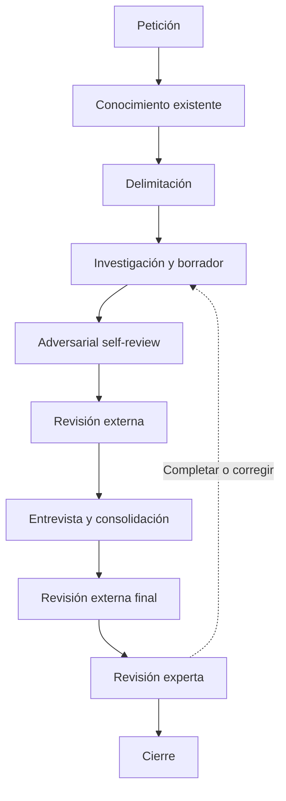

# DNA Harvest

Investiga un área y contrasta los hallazgos con el experto para crear o actualizar su conocimiento
funcional y técnico en `dna/`. El resultado debe servir a personas y agentes sin contexto previo.
Una tarea puede orientar la captura, pero lo documentado debe entenderse sin conocer esa tarea.

## Principios

- Investiga el código antes de preguntar al experto. Pregunta sobre hallazgos concretos.
- Contrasta la documentación con el código. El código acredita la implementación, no la corrección
  del negocio.
- Distingue comportamiento observado, reglas esperadas y testimonio experto.
- Conserva el motivo y el ámbito de reglas y excepciones. Declara lo desconocido sin inventarlo.
- Acota la captura y declara su cobertura. En actualizaciones, revisa solo el contenido afectado.
- No corrijas código durante la captura.
- Prioriza claridad sobre volumen, según [Redacción](#redacción).

## Idioma

Escribe los documentos en español por defecto. Si el usuario indica otro idioma, úsalo también en
los títulos y campos de las plantillas.

- Conserva en inglés los términos habituales del software: endpoint, framework, deploy, rollback.
- No traduzcas nombres ni identificadores del código.

## Redacción

Escribe claro y sencillo. El criterio es la información, no la longitud:

- Cada frase aporta un hecho, una regla, un motivo, un ancla o un límite. Si al quitarla no se
  pierde nada, quítala.
- Sin introducciones, resúmenes, repeticiones ni relleno. Enlaza lo ya explicado.
- Recortar no justifica omitir. Conserva hechos, reglas con motivo y ámbito, excepciones, anclas,
  procedencia, discrepancias y limitaciones.
- Ante la duda, conserva la información y simplifica la redacción.
- Usa diagramas cuando aclaren.

## Estructura

Crea o actualiza los artefactos en el repositorio del sistema investigado:

```text
dna/
|-- index.md                              # obligatorio
|-- deferred-findings.md
`-- domains/
    `-- <domain>/
        |-- index.md                      # obligatorio
        `-- <area>/
            |-- 00_harvest.md             # obligatorio
            |-- 01_about.md               # obligatorio
            |-- 02_vocabulary.md
            |-- 03_invariants.md
            |-- 04_flow-map.md            # obligatorio
            |-- 05_implementation-map.md  # obligatorio
            |-- 06_caveats.md
            `-- 07_unknowns.md
```

- En capturas parciales, indica qué está documentado y qué queda sin explorar.
- Los índices describen y enlazan el contenido existente sin duplicarlo.
- Conserva la organización y el contenido ajenos al alcance.

## Documentos del área

Cada dato va al archivo que le corresponde. Crea los opcionales solo con contenido relevante, nunca
vacíos.

| Archivo                    | Contenido                                              | Cuándo             |
| -------------------------- | ------------------------------------------------------ | ------------------ |
| `01_about.md`              | Propósito, límites, cobertura y qué queda sin explorar | Siempre            |
| `04_flow-map.md`           | Flujos, estados, orden y excepciones                   | Siempre            |
| `05_implementation-map.md` | Anclas, dependencias, impacto y qué verificar          | Siempre            |
| `02_vocabulary.md`         | Términos del negocio y su representación en código     | Solo con contenido |
| `03_invariants.md`         | Reglas que deben cumplirse, motivo y ámbito            | Solo con contenido |
| `06_caveats.md`            | Comportamientos contraintuitivos y diagnóstico         | Solo con contenido |
| `07_unknowns.md`           | Dudas que quedarán abiertas en la entrega              | Solo con contenido |
| `dna/deferred-findings.md` | Hallazgos importantes fuera del alcance (global)       | Solo con contenido |

## Estado y continuidad

`00_harvest.md` guarda el trabajo de la captura y su estado en el frontmatter `status`. El estado
afecta solo al alcance en curso y conserva las aprobaciones anteriores que sigan vigentes.

| Estado           | Significado                                                                |
| ---------------- | -------------------------------------------------------------------------- |
| `draft`          | Investigación y borrador en preparación.                                   |
| `pending-expert` | Faltan respuestas del experto o su consolidación.                          |
| `in-review`      | Revisado por el agente; pendiente de aprobación experta.                   |
| `validated`      | El experto ha aprobado el contenido y su alcance. La captura está cerrada. |

Transiciones:

- Recorrido habitual: `draft` → `pending-expert` → `in-review` → `validated`.
- Sin preguntas al experto, pasa de `draft` a `in-review`.
- Si hace falta investigar, vuelve a `draft`. Si solo falta aclaración experta, a `pending-expert`.
  Las correcciones de redacción pueden quedarse en `in-review`.
- Reabre una captura validada solo por un alcance nuevo o una corrección identificada.
- Cerrar la sesión no cambia el estado.

Mantenimiento de `00_harvest.md`:

- Al retomar, léelo con sus documentos enlazados y continúa desde el próximo paso registrado.
  Reinvestiga solo ante cambios en las fuentes, nuevas pistas o evidencia insuficiente.
- Mantén alcance, investigación, hallazgos pendientes, preguntas, revisión y próximo paso.
  Actualízalo al cambiar de estado y antes de cerrar o interrumpir la sesión.
- Sustituye los hallazgos consolidados por enlaces a su documento definitivo.
- Trabaja aquí las preguntas de la captura. Traslada a `07_unknowns.md` las incógnitas que
  permanezcan en la entrega.
- No transcribas conversaciones ni registres cada búsqueda.

## Hallazgos diferidos

`dna/deferred-findings.md` es global a DNA y recoge tres casos:

- Hallazgo que necesita atención fuera del alcance actual, aunque atenderlo no consista en
  documentar. Incluye los defectos confirmados por el experto.
- Conocimiento importante del dominio que debe documentarse en otra captura. Explica por qué es
  relevante.
- Propuesta de cambio del experto: regla o comportamiento deseado que aún no está vigente. No es
  verdad actual y no entra en los documentos del área. Registra quién lo propone y cuándo. Las
  ideas sueltas no se registran.

Reglas:

- Créalo con el primer hallazgo y enlázalo desde `dna/index.md`.
- Cada entrada explica qué se encontró, dónde, sus referencias, por qué importa y por qué queda
  fuera del alcance.
- Reutiliza entradas del mismo asunto. Registrar un hallazgo no implica resolverlo en esta captura.
- No lo uses como historial ni como lista de todo lo que falta explorar.

Destino de cada pendiente:

- `00_harvest.md`: trabajo y preguntas de la captura actual.
- `07_unknowns.md`: dudas o contradicciones abiertas en la documentación entregada.
- `dna/deferred-findings.md`: los tres casos anteriores.

## Contenido y evidencia

- Explica significado funcional, entradas, condiciones, resultados, supuestos y efectos
  relevantes. Enlaza el código que se explica por sí mismo; no lo narres línea a línea.
- Relaciona el vocabulario del negocio con tipos, tablas e interfaz.
- Documenta secuencias y comportamiento en `04_flow-map.md`; código, acoplamientos e impacto en
  `05_implementation-map.md`. Enlaza lo compartido.
- Usa diagramas ASCII en bloques `text` cuando aclaren. Etiqueta llamadas, eventos y datos
  compartidos. Distingue relaciones verificadas de inferidas.
- Indica la procedencia junto a cada afirmación no evidente o al bloque que respalda:
  - Código: ruta y símbolo, test, tabla o contrato.
  - Experto: identidad o rol y fecha.
  - Incidente: referencia verificable.
  - Decisión: ADR o explicación atribuida.
  - Normativa: fuente aplicable y vigencia. Si solo hay testimonio experto, atribúyelo y deja
    pendiente la verificación normativa.
- Declara qué has comprobado y sus límites. Los tests respaldan solo los casos que ejercitan. La
  lectura estática no demuestra ejecución en producción ni ausencia de consumidores externos.
  Considera datos, configuración y versión desplegada.
- Mantén explícitas las discrepancias entre código y reglas de negocio. Registra lo irresuelto en
  `07_unknowns.md`.
- Marca el contenido nuevo o modificado pendiente de aprobación experta con `> Pendiente de revisión`
  bajo el título del bloque o del documento. Retírala al aprobarse.

## Templates

Lee solo las plantillas de los artefactos que vas a crear o modificar. Sustituye las indicaciones
entre llaves por contenido comprobado y elimina las instrucciones del resultado.

- [root-index.md](templates/root-index.md): `dna/index.md`. Enumera los dominios y enlaza sus índices.
- [domain-index.md](templates/domain-index.md): `dna/domains/<domain>/index.md`. Propósito y límites
  del dominio; enlaza el `01_about.md` de cada área.
- [deferred-findings.md](templates/deferred-findings.md): `dna/deferred-findings.md`.
- [00_harvest.md](templates/00_harvest.md): trabajo y estado de la captura.
- [01_about.md](templates/01_about.md): descripción del área.
- [02_vocabulary.md](templates/02_vocabulary.md): lenguaje ubicuo.
- [03_invariants.md](templates/03_invariants.md): invariantes.
- [04_flow-map.md](templates/04_flow-map.md): flujos.
- [05_implementation-map.md](templates/05_implementation-map.md): implementación e impacto.
- [06_caveats.md](templates/06_caveats.md): caveats.
- [07_unknowns.md](templates/07_unknowns.md): desconocidos.

## Flujo



El diagrama agrupa las fases y resume los retornos en una sola flecha. Desde cualquier revisión,
entrevista o consolidación, vuelve solo al paso necesario:

- Investigar, si falta evidencia técnica.
- Entrevistar, si falta una aclaración del experto.
- Consolidar, si basta con incorporar correcciones.

## Pasos

### 1. Petición

Trabaja por defecto en el repositorio desde el que se invoca la skill.

Determina el tipo de captura con la información disponible:

- Ticket de Jira o explicación de una tarea: captura a partir de una tarea.
- Dominio, área o tema que documentar: captura directa.
- Sin información suficiente: pregunta qué quiere hacer y pide solo los datos que falten.

Captura directa:

- Recoge el dominio o área y el tema que se quiere explicar.
- Usa el directorio, archivo de código o contexto adicional que aporte el usuario.

Captura a partir de una tarea:

- Recoge el ticket o la explicación. Si no puedes acceder al ticket, pide su contenido.
- Identifica el problema, el comportamiento focal y los ejemplos disponibles.
- No adelantes el diseño ni propongas una solución.
- Directorio o archivo de código, dominio o área y contexto adicional son opcionales.

En ambos casos:

- Define qué debe explicar la captura y qué podrá hacer el receptor con ese conocimiento.
- No repitas datos ya proporcionados ni conviertas la entrada en un cuestionario.
- Localiza la ruta de código si no se ha indicado. El código aportado es un punto de partida, no
  un límite: explora las conexiones que hagan falta.
- Identifica de forma provisional dominio, área y tema con la petición y una exploración inicial.
  Pregunta solo si no puedes identificarlos.

### 2. Conocimiento existente

Muestra este mensaje antes de buscar:

🧐 Consultando conocimiento existente en dna/

Consulta:

- `dna/index.md` y el índice del dominio.
- La captura previa del área y `dna/deferred-findings.md`, si existen.
- No abras los documentos encontrados de forma automática.

Con documentos que parezcan relevantes:

- Indica su ruta y por qué pueden aportar contexto.
- Pregunta al usuario cuáles quiere que leas. Lee solo los que confirme.

Con lo leído:

- Determina si el tema ya está documentado, debe ampliarse o requiere una captura nueva.
- No dupliques conocimiento. Actualiza o amplía el documento existente si ya cubre parte del tema.
- Ten presentes hechos, reglas, anclas y pendientes relevantes durante la captura.
- Sin documentación relacionada, trata la petición como captura inicial.
- Si hay indicios de duplicación y el usuario no quiere abrir los documentos, explica el riesgo.
  Si insiste, continúa sin abrirlos y mantén visible esa limitación.

### 3. Delimitación

Muestra este mensaje antes de empezar:

🎯 Ahora vamos a delimitar el dominio y el área de la captura.

- Dominio: parte del negocio con propósito, vocabulario, reglas y límites propios.
- Área: parte concreta del dominio donde vive el conocimiento que se documenta.

Prepara una propuesta:

- Dominio y área. Reutiliza los nombres existentes. Si hace falta uno nuevo, indícalo.
- Tema y cobertura: qué se documentará y qué quedará fuera. Puede cubrir un área completa o un
  flujo concreto.
- Tipo de captura: nueva, ampliación de una existente o actualización de una parte.
- Contexto necesario para explicar el tema, sin dependencias que no aporten.

Pide el ok explícito a tres cosas: dominio, área y línea de trabajo (tema, cobertura y tipo).
Espera siempre la confirmación:

- Si corrige algo, ajusta la propuesta y vuelve a pedir el ok.
- No escribas en `dna/` sin las tres confirmadas.

Con el ok:

- Captura nueva: crea `00_harvest.md` con su [plantilla](templates/00_harvest.md), `status: draft`
  y las secciones `Alcance`, con su resultado esperado, y `Próximo paso`.
- Captura existente: sigue su continuidad y actualiza el alcance si cambia.
- Lo importante que queda fuera: [Hallazgos diferidos](#hallazgos-diferidos).

### 4. Investigación

Muestra este mensaje antes de empezar:

🔬 Investigando el sistema

Fuentes:

- Código aportado y sus dependencias.
- Tests, formularios, APIs, procesos, eventos, esquemas y configuración pertinentes.
- Documentación existente: `docs/`, `adr/`, README y comentarios del código. Contrástala con el
  código y documenta las discrepancias.

Cómo leer:

- En archivos grandes, localiza símbolos o bloques funcionales y lee solo los tramos necesarios.
- En métodos monolíticos, identifica operaciones, condiciones y flujo de control.
- No cargues archivos completos por defecto.

Qué seguir:

- Vocabulario: tipos, tablas, campos y etiquetas de interfaz.
- Entradas: quién las prepara, qué condiciones activan el bloque y qué dependencias usa.
- Salidas: resultados, consumidores, lecturas y escrituras, estado compartido, cachés.
- Configuración por entorno o cliente que condicione el comportamiento.
- Orden temporal: jobs, concurrencia, límites transaccionales y estado ante fallos.
- Casos límite y posibles regresiones, con su mecanismo y evidencia.
- Tests y puntos de diagnóstico que protejan u observen el comportamiento.
- Ganchos para la entrevista: literales especiales, excepciones por cliente, comentarios de
  advertencia, errores ignorados, órdenes implícitos y contradicciones. Anótalos en `Hallazgos por
incorporar` de `00_harvest.md`, con evidencia y posible destino.

Conexiones:

- Busca consumidores y proveedores. Una referencia ausente no prueba código muerto: considera
  configuración, ejecución dinámica e integraciones no disponibles.
- Por cada conexión relevante, elige: profundizar si puede cambiar la interpretación, documentar
  su contrato si basta para entenderla, o declarar frontera no verificada si falta evidencia.
- Si queda fuera del alcance acordado, sigue [Hallazgos diferidos](#hallazgos-diferidos)
  y conserva aquí solo el contrato o la frontera.

Cuándo parar:

- Puedes explicar el recorrido focal: condiciones, entradas, salidas y conexiones relevantes.
- Las limitaciones restantes están identificadas.
- No impongas un número fijo de saltos ni recorras todo el sistema.
- Un hueco que impida entender el recorrido exige más evidencia o se declara bloqueante para las
  decisiones que dependan de él. No investigues indefinidamente.

Registra en `Investigación realizada` de `00_harvest.md`:

- Fecha y revisión del código consultada. Indica los cambios locales relevantes.
- Recorrido comprobado y anclas encontradas.
- Limitaciones de la investigación.
- En actualizaciones parciales, asocia esta referencia al alcance revisado.

En actualizaciones, verifica el contenido afectado y sus relaciones. Conserva el resto.

### 5. Borrador

Muestra este mensaje antes de empezar:

📝 Preparando el borrador

**Importante.** Aplica las reglas de [Redacción](#redacción).

Documentos:

- Crea o actualiza los [documentos del área](#documentos-del-área) con las
  [plantillas](#templates) y la evidencia disponible.
- Sigue las reglas de [Contenido y evidencia](#contenido-y-evidencia).
- Mantén navegables `dna/index.md` y el índice del dominio.

Pendiente de revisión:

- Marca el contenido nuevo o modificado con `> Pendiente de revisión`.
- Conserva las validaciones anteriores solo para el contenido no afectado.
- En `00_harvest.md`, separa el alcance aprobado del pendiente. Una actualización parcial no
  renueva la validación de toda el área.

Preguntas para el experto:

- Convierte en preguntas los ganchos anotados en el paso 4.
- Prioriza por impacto y por lo que impide entender el flujo. No preguntes cada detalle técnico.
- Guárdalas en `Preguntas pendientes` de `00_harvest.md`, por prioridad, con contexto y ancla.
- Con preguntas listas, establece `status: pending-expert`.

Actualiza `Próximo paso` de `00_harvest.md` y haz un commit solo con los cambios DNA de la
sesión: `docs(dna): draft {domain}/{area}`.

### 6. Adversarial self-review

Muestra este mensaje antes de empezar:

🕵️ Revisando el borrador

**Importante.** Comprueba que el texto cumple [Redacción](#redacción).

Revisa el borrador como un revisor hostil que quiere tumbarlo. Busca:

- Afirmaciones sin ancla o con ancla que no resuelve.
- Hechos observados, reglas esperadas y testimonios mezclados como una sola evidencia.
- Reglas y excepciones sin motivo ni ámbito, o con un motivo supuesto.
- Conexiones afirmadas sin evidencia; fronteras no verificadas presentadas como comprobadas.
- Impacto definitivo de cambios no diseñados; garantías inventadas. Distingue tests existentes de
  verificaciones propuestas.
- Diagramas que contradicen las fuentes; enlaces internos rotos.
- Texto que incumple [Redacción](#redacción) y placeholders de plantilla.
- Incoherencias entre `01_about.md`, vocabulario, invariantes y mapas.

Con los hallazgos:

- Corrige lo demostrable.
- Lo que requiera conocimiento experto: pregunta nueva en `Preguntas pendientes` de
  `00_harvest.md`, según su prioridad.
- Lo que no pueda resolverse: `07_unknowns.md`.
- No investigues indefinidamente desconocidos ya reconocidos.

Actualiza `Próximo paso` de `00_harvest.md` y haz un commit con las correcciones:
`docs(dna): draft self-review {domain}/{area}`.

### 7. Revisión externa

La revisión externa la hace un revisor sin contexto de la sesión, persona o agente. Comprueba forma
y evidencia. No sustituye la validación del experto ni cambia el `status` de `00_harvest.md`.

Muestra esta petición:

> **Listo para revisión** 🤝
>
> - Documentos: {rutas creadas o modificadas en la sesión, incluidos `00_harvest.md` y
>   `dna/deferred-findings.md` si cambió}.
> - Alcance: {dominio, área, tema y cobertura acordados en el paso 3}.
> - Consideraciones: {fronteras no verificadas, fuentes sin acceso, documentos relacionados no
>   abiertos, hallazgos diferidos; omitir si no hay nada no evidente}.
> - Qué revisar con ojos nuevos:
>   - Anclas que resuelven y procedencia en cada afirmación no evidente.
>   - Hechos observados, reglas esperadas y testimonio experto separados.
>   - Reglas y excepciones con motivo y ámbito, o con la duda declarada.
>   - Conexiones e impacto respaldados por evidencia; fronteras no verificadas declaradas.
>   - Cada dato en su archivo y sin duplicar; índices que llegan al contenido nuevo.
>   - Contenido comprensible sin conocer la tarea ni la conversación.
>   - Redacción sin relleno y sin placeholders de plantilla.
> - Cómo reportar: cada finding cita ruta y texto; sin propuestas de solución. 🔴 impide usar el
>   conocimiento; 🟡 mejora.

Detente y espera. El usuario responde con los findings o con "sin findings". Sin findings, pasa al
paso 8.

Con findings:

- Trátalos como observaciones, no como verdades. Contrasta cada uno con las fuentes, no con la
  memoria de la sesión. Rechaza con seguridad los incorrectos, sin contexto o sin valor.
- Acuerda con el usuario un destino por finding:

| Destino   | Acción                                                                                          |
| --------- | ----------------------------------------------------------------------------------------------- |
| Aplicar   | Corregir el documento afectado.                                                                 |
| Preguntar | Requiere conocimiento experto: `Preguntas pendientes` de `00_harvest.md`, con contexto y ancla. |
| Registrar | No puede resolverse con las fuentes disponibles: `07_unknowns.md`.                              |
| Diferir   | Importante pero fuera del alcance: [Hallazgos diferidos](#hallazgos-diferidos).                 |
| Rechazar  | Incorrecto, sin valor o decisión deliberada: motivo en la conversación.                         |

- No amplíes el alcance por un finding. Si lo exige, vuelve a acordarlo según el paso 3.
- Revisa las partes cambiadas con los criterios del paso 6.

Pregunta al usuario:

❓ Findings resueltos. ¿Otra ronda de revisión o continuar?

Espera su decisión. Otra ronda: repite la petición con los documentos actualizados. Continuar: paso 8.

Actualiza `Próximo paso` de `00_harvest.md` y haz un commit:
`docs(dna): draft external-review {domain}/{area}`.

### 8. Entrevista

Sin preguntas en `Preguntas pendientes` de `00_harvest.md`, salta al paso 9.

Muestra este mensaje antes de empezar:

❓ Preguntas para el domain expert

El experto responde en la conversación, directamente o a través del usuario.

Al empezar:

- Pide una vez el nombre o rol del experto y anota la fecha. Es la procedencia de cada respuesta.
- Establece `status: pending-expert` si no lo está.
- Recorre las preguntas en el orden en que están guardadas.

Por cada pregunta:

- Una pregunta por mensaje, también las repreguntas. Espera la respuesta antes de seguir.
- Formula en términos funcionales. El hallazgo y su ancla van como referencia, con contexto mínimo.
- Valida primero el recorrido funcional; después motivos, invariantes, excepciones y diagnóstico.
- Repregunta hasta cerrar el tema: hecho o regla, motivo, ámbito, excepciones y procedencia, o el
  experto declara que no lo sabe.
- No completes con suposiciones. Si la respuesta es parcial o ambigua, repregunta.
- Reformula lo entendido y pide confirmación. Registra solo lo confirmado.
- Registra cada respuesta confirmada en `00_harvest.md`, junto a su pregunta y con procedencia,
  por si la sesión se interrumpe.

Pregunta también, cuando ayude a explicar un riesgo:

- Incidentes reales: qué ocurrió, qué señal lo detectó, qué se descartó y qué habría interpretado
  mal alguien nuevo.
- Dependencias operativas ausentes del código: preparación manual, correcciones de datos,
  integraciones fuera del recorrido investigado.

Contrasta cada respuesta con las fuentes y actúa según el caso:

| Caso                                             | Acción                                                                                                                                                           |
| ------------------------------------------------ | ---------------------------------------------------------------------------------------------------------------------------------------------------------------- |
| Coincide con el código                           | Hecho o regla con procedencia, pendiente de consolidar en el paso 9.                                                                                             |
| Contradice el código                             | Distingue lo que debería ocurrir de lo que ocurre y pide aclaración. Defecto confirmado: discrepancia en `03_invariants.md` y entrada en `deferred-findings.md`. |
| Describe un cambio deseado, no una regla vigente | Propuesta de cambio en `deferred-findings.md`.                                                                                                                   |
| Abre otra ruta que condiciona el recorrido       | Vuelve al paso 4, actualiza los mapas y retoma la entrevista.                                                                                                    |
| Genera una pregunta nueva                        | Insértala en `Preguntas pendientes` según su prioridad y sigue.                                                                                                  |
| El experto no lo sabe                            | Márcala como candidata a `07_unknowns.md`.                                                                                                                       |
| La pregunta no aplica                            | Descártala con un motivo breve.                                                                                                                                  |

Cierre:

- Cierra la entrevista cuando todas las preguntas estén respondidas, trasladadas o descartadas.
- Si el experto no está disponible y quedan preguntas, conserva `status: pending-expert`, registra
  el próximo paso y cierra la sesión.
- Actualiza `Próximo paso` de `00_harvest.md` y haz un commit, también si quedan preguntas
  pendientes: `docs(dna): interview {domain}/{area}`.

### 9. Consolidación

Muestra este mensaje antes de empezar:

🧩 Consolidando respuestas

**Importante.** Aplica las reglas de [Redacción](#redacción).

Sin respuestas que incorporar, establece `status: in-review` y salta al paso 12.

Por cada respuesta confirmada:

- Escribe el hecho, regla, término, flujo o caveat en su [documento del área](#documentos-del-área),
  con su procedencia. Los defectos y las propuestas ya tienen destino desde el paso 8.
- Marca el contenido nuevo o modificado con `> Pendiente de revisión`.
- Si creas un archivo, enlázalo en `Navegación` de `01_about.md`. Mantén navegables los índices.
- Sustituye en `00_harvest.md` los hallazgos y respuestas consolidados por enlaces a su destino.
- Traslada a `07_unknowns.md` las incógnitas que seguirán abiertas, incluidas las candidatas del
  paso 8, sin mantener dos copias.

Actualiza `Próximo paso` de `00_harvest.md` y haz un commit:
`docs(dna): interview consolidate {domain}/{area}`.

### 10. Self-review final

Muestra este mensaje antes de empezar:

🕵️ Revisando la consolidación

**Importante.** Comprueba que el texto cumple [Redacción](#redacción).

Repite el self-review del paso 6 sobre el contenido nuevo o modificado:

- Contradicción que requiere conocimiento experto: pregunta nueva en `Preguntas pendientes` y
  vuelve al paso 8.
- Falta evidencia técnica: vuelve al paso 4.

Sin preguntas pendientes ni findings abiertos, establece `status: in-review`.

Actualiza `Próximo paso` de `00_harvest.md` y haz un commit:
`docs(dna): interview self-review {domain}/{area}`.

### 11. Revisión externa final

Repite el paso 7 sobre el contenido consolidado:

- La petición enumera solo los documentos modificados desde la revisión anterior y las respuestas
  del experto incorporadas.
- Triaje con la misma tabla de destinos. Un finding con destino Preguntar vuelve al paso 8 y
  después al 9.

Actualiza `Próximo paso` de `00_harvest.md` y haz un commit:
`docs(dna): interview external-review {domain}/{area}`.

### 12. Revisión experta

Muestra este mensaje antes de empezar:

🎓 Revisión experta

**Importante.** Aplica las reglas de [Redacción](#redacción) a los cambios.

Pregunta al usuario:

❓ ¿Quién es el experto que ha revisado?

Detente y espera. Registra nombre y fecha en `Revisión` de `00_harvest.md`. Es la procedencia de
esta revisión.

Pregunta al usuario:

❓ Alcance revisado: {dominio, área, tema y cobertura}. ¿Está todo correcto o hay hallazgos que
revisar? Puedes darlos uno a uno o todos a la vez.

Detente y espera. Con la aprobación, pasa a `Con la aprobación`.

Por cada finding:

- Reformula lo entendido y confirma antes de actuar.
- Analiza el finding contra las fuentes y da tu recomendación al experto.
- Si coincides, aplícalo.
- Si discrepas, expón tu evidencia. El experto decide. Si mantiene el finding, aplícalo con
  procedencia experta y registra tu evidencia contraria en `07_unknowns.md` como contradicción
  entre código y testimonio.
- Trata su contenido como una respuesta del paso 8: mismos casos y destinos.
- Revisa las partes cambiadas con los criterios del paso 6.

Tras resolver los findings, repite la pregunta de alcance solo con las partes cambiadas. Continúa
hasta la aprobación explícita.

Con la aprobación:

- Registra en `Revisión` de `00_harvest.md` quién revisó, cuándo y qué alcance aprobó.
- Retira las marcas `> Pendiente de revisión` del contenido aprobado.
- No pases al paso 13 sin aprobación explícita de todo el alcance.

Actualiza `Próximo paso` de `00_harvest.md` y haz un commit:
`docs(dna): expert-review {domain}/{area}`.

### 13. Cierre

Muestra este mensaje antes de empezar:

🏁 Finalizando captura

Revisa a alto nivel que todo encaja, sin entrar en el detalle:

- `dna/index.md` y el índice del dominio llegan al contenido nuevo.
- `01_about.md` es coherente con los mapas y con los archivos que existen.
- No quedan marcas `> Pendiente de revisión` ni placeholders de plantilla.
- `dna/deferred-findings.md`: retira las entradas resueltas o documentadas en esta captura y
  conserva las pendientes con su contexto. Comprueba su enlace desde `dna/index.md`.
- `00_harvest.md` no tiene preguntas pendientes y `Próximo paso` indica que no hay acción pendiente.

Si algo no encaja, vuelve al paso que corresponda según [Flujo](#flujo).

Establece `status: validated` en `00_harvest.md`.

Haz un commit solo con los cambios DNA de la sesión: `docs(dna): finalize {domain}/{area}`.
