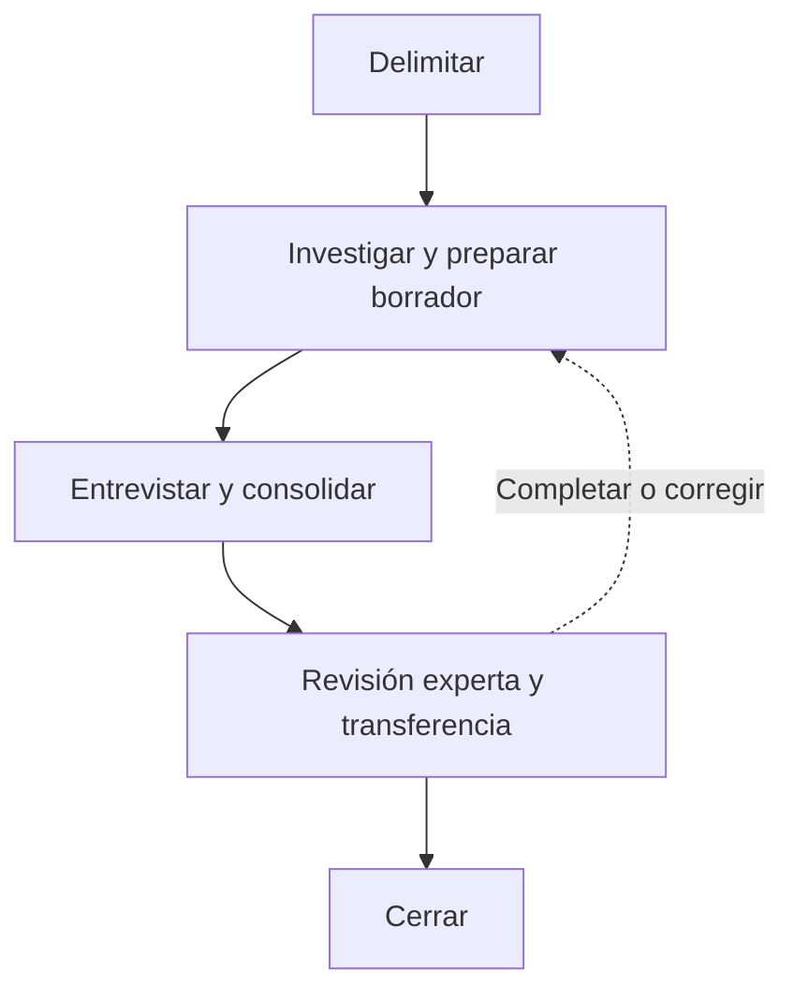

# DNA Harvest

Investigar un área, contrastar los hallazgos con el experto y documentar su conocimiento funcional
y técnico en `dna/`. Producir contexto reutilizable para personas y agentes siguiendo las
plantillas de la skill. Una tarea puede orientar la captura, pero el conocimiento documentado debe
ser reutilizable sin conocer ese ticket. El comportamiento futuro y las decisiones del cambio se
definen después en `sdd-spec`.

## Principios

- Investigar el código antes de entrevistar al experto. Formular preguntas sobre hallazgos concretos.
- Combinar significado funcional e implementación técnica dentro del área.
- El código de la revisión investigada es la fuente de verdad sobre la implementación actual.
  Contrastar con él la documentación; no atribuirle autoridad sobre la corrección del negocio.
- Distinguir comportamiento observado, reglas esperadas y testimonio experto.
- Conservar el motivo y el ámbito de las reglas y excepciones. Registrar lo desconocido sin inventarlo.
- Acotar la captura y declarar su cobertura. En actualizaciones, revisar el contenido afectado.
- Documentar cada dato una sola vez. Priorizar explicaciones breves, anclas y diagramas que aporten claridad.

## Estructura

Crear o actualizar los artefactos en el repositorio del sistema investigado:

```text
dna/
|-- index.md                              # obligatorio
`-- domains/
    `-- <domain>/
        |-- index.md                      # obligatorio
        `-- <area>/
            |-- harvest.md                # estado y trabajo de la captura
            |-- 01_about.md               # obligatorio
            |-- 02_vocabulary.md
            |-- 03_invariants.md
            |-- 04_flow-map.md            # obligatorio
            |-- 05_implementation-map.md  # obligatorio
            |-- 06_caveats.md
            `-- 07_unknowns.md
```

Crear `harvest.md` al iniciar una captura. Crear los demás documentos sin marcar solo cuando tengan
contenido. En una captura parcial, describir la cobertura de los documentos obligatorios sin
aparentar que representan toda el área.

Los índices presentan y enlazan el contenido existente. No duplicar en ellos las reglas de las áreas.
Conservar la organización y el contenido ajenos al alcance de la sesión.

## Estado y continuidad

`harvest.md` es el documento de trabajo de la captura dentro del área. Su frontmatter `status`
indica el estado del alcance en curso; no invalida aprobaciones anteriores de contenido no afectado.

| Estado | Significado y siguiente acción |
| --- | --- |
| `draft` | Investigar, preparar documentos y preguntas. |
| `pending-expert` | Borrador preparado; esperar o recoger las respuestas del experto y consolidarlas. |
| `in-review` | Contenido consolidado y revisado por el agente; resolver observaciones y obtener aprobación experta. |
| `validated` | El experto ha aprobado explícitamente el contenido y el alcance indicados. |

Recorrido habitual: `draft` → `pending-expert` → `in-review` → `validated`. Si no hacen falta
preguntas, pasar de `draft` a `in-review`. Una nueva investigación devuelve lo afectado a `draft`;
si solo falta una respuesta experta, usar `pending-expert`. Las correcciones de redacción pueden
permanecer en `in-review`. Terminar una sesión no cambia el estado; la transferencia se registra aparte.

Al retomar, leer `harvest.md` y los documentos que enlaza. Continuar desde el estado y próximo paso
registrados, sin repetir toda la investigación. Revisar código de nuevo cuando cambien las fuentes,
aparezcan nuevas pistas o la evidencia sea insuficiente. Una captura `validated` solo se reabre para
un alcance nuevo o una corrección identificada, conservando las aprobaciones que sigan vigentes.

Mantener en `harvest.md` alcance, investigación realizada, hallazgos por incorporar, preguntas,
revisión y próximo paso. Actualizarlo al cambiar de estado y antes de interrumpir o cerrar la sesión.
No registrar cada búsqueda ni transcribir la conversación. Una vez consolidado un hallazgo, sustituir
su desarrollo por un enlace al documento definitivo. Las dudas de la captura viven aquí; las
incógnitas relevantes que permanezcan en el conocimiento entregado viven en `07_unknowns.md`.

## Reglas de contenido y evidencia

- Escribir en castellano y conservar la terminología técnica habitual.
- Explicar significado funcional, entradas, condiciones, resultados, supuestos y efectos relevantes.
  Enlazar las instrucciones que ya se entienden al leerlas, sin narrarlas línea a línea.
- Omitir introducciones genéricas, resúmenes repetidos y secciones vacías.
- Usar el vocabulario para establecer el lenguaje ubicuo y relacionarlo con tipos, tablas e interfaz.
- Explicar secuencias y comportamiento en `flow-map`; localizar código, acoplamientos e impacto en
  `implementation-map`. Enlazar entre ambos cuando compartan un elemento.
- Añadir diagramas ASCII en bloques `text` cuando aclaren flujos o dependencias. Etiquetar las
  relaciones y distinguir llamadas, eventos y datos compartidos. No dibujar relaciones inferidas
  como si estuvieran verificadas.
- Toda afirmación no evidente indica procedencia: `código`, `experto`, `incidente`, `decisión` o
  `normativa`. Para código, citar ruta y símbolo, test, tabla o contrato; para experto, identidad o
  rol y fecha; para incidente, referencia verificable; para decisión, ADR o explicación atribuida.
  Para normativa, identificar la fuente aplicable y su vigencia. Si solo hay testimonio sobre ella,
  atribuirlo al experto y dejar pendiente la verificación normativa.
- Situar la evidencia junto a la afirmación o al bloque que respalda. Una referencia genérica al
  repositorio no demuestra una afirmación concreta.
- Los tests acreditan únicamente el comportamiento que ejercitan. La lectura estática no demuestra
  ejecución en producción ni ausencia de consumidores externos. El comportamiento de un escenario
  también depende de datos, configuración y versión desplegada; declarar qué se ha comprobado.
- No convertir el comportamiento del código en una regla de negocio sin contrastarlo. Conservar
  las discrepancias explícitas y registrar lo irresuelto en `07_unknowns.md`.
- Explicar el motivo y ámbito de reglas y excepciones. Señalar cuando se desconocen.
- No enlazar DNA a SDD. Enlazar ADR solo cuando condicione el contenido. Conservar en DNA el contexto
  necesario para entender la regla sin reconstruir el historial de cambios.

## Templates

Leer solo las plantillas de los artefactos que se van a crear o modificar. Sustituir las indicaciones
entre llaves por contenido comprobado y retirar las instrucciones de plantilla del resultado.

- Índice global: [templates/root-index.md](templates/root-index.md).
- Índice de dominio: [templates/domain-index.md](templates/domain-index.md).
- Trabajo y estado de la captura: [templates/harvest.md](templates/harvest.md).
- Descripción del área: [templates/about.md](templates/about.md).
- Lenguaje ubicuo: [templates/vocabulary.md](templates/vocabulary.md).
- Invariantes: [templates/invariants.md](templates/invariants.md).
- Flujos: [templates/flow-map.md](templates/flow-map.md).
- Implementación e impacto: [templates/implementation-map.md](templates/implementation-map.md).
- Caveats: [templates/caveats.md](templates/caveats.md).
- Desconocidos: [templates/unknowns.md](templates/unknowns.md).

## Skills relacionadas

- Aplicar `unslop`, `md-essentials` y `spanish-artifacts` si están disponibles en el repositorio destino.
- Usar `git-operations` antes de operaciones Git si está disponible. Respetar las convenciones del
  repositorio y la autorización de la sesión para commits.

## Flujo



El diagrama agrupa las fases y resume los retornos en una sola flecha. Desde la entrevista,
consolidación, revisión experta o transferencia, volver solo al paso necesario:

- Investigar si falta evidencia técnica.
- Entrevistar si falta una aclaración del experto.
- Consolidar si basta con incorporar correcciones.

Conservar el alcance y lo ya validado que siga vigente. Los cambios vuelven a la revisión que
corresponda. Si falta el experto, conservar `pending-expert` cuando falten respuestas o `in-review`
cuando solo falte aprobación. Si no se realiza la transferencia, declararla pendiente al cerrar.

### 1. Delimitar el área

Localizar el repositorio y leer sus instrucciones. Consultar los índices DNA existentes y abrir
solo las áreas relacionadas. Identificar si se trata de una captura inicial o una actualización.
Si parte de una tarea, recoger el problema, el comportamiento focal y un ejemplo que permita
localizarlo, sin adelantar el diseño. Contrastar la cobertura existente con las anclas relevantes.
Reutilizar el conocimiento vigente y capturar solo lo que falte o haya cambiado, también cuando el
humano lo conozca pero aún no esté documentado. Si no hay nada que incorporar, pasar al cierre sin
crear cambios ni repetir la entrevista.

Acordar con el usuario dominio, área, alcance y fuentes accesibles. Si ya están claros en su
petición, continuar. Usar nombres existentes; confirmar nombres o límites nuevos antes de escribir.
Una sesión puede cubrir un flujo concreto dentro del área. Identificar también qué debe poder hacer
el receptor con ese conocimiento. Si la captura es nueva, crear `harvest.md` en `draft` con ese
alcance y el siguiente paso. Si ya existe, seguir la continuidad registrada en él.

Distinguir el foco inicial del contexto necesario para comprenderlo. El alcance de modificación se
decidirá en la especificación y el plan; investigar una dependencia no implica cambiarla.
Un intervalo de líneas es un punto de entrada, no una frontera de investigación ni una unidad DNA.
En archivos grandes, localizar símbolos o bloques funcionales y leer los tramos pertinentes. En
métodos monolíticos, identificar operaciones, condiciones y flujo de control junto a la revisión del
código. No cargar todo el archivo por defecto ni excluir dependencias por estar fuera del intervalo.

Si falta acceso al código, pedir su ubicación o acceso antes de preparar mapas técnicos. No inventar
la implementación a partir del nombre del área. No ampliar el alcance a todo el sistema al seguir
dependencias externas.

### 2. Investigar el sistema

Leer código, tests, formularios, APIs, procesos, eventos, esquemas y configuración pertinentes.

- Derivar el vocabulario desde tipos, tablas, campos y etiquetas de interfaz.
- Seguir quién prepara las entradas, qué condiciones activan el bloque y qué dependencias utiliza.
- Seguir resultados y consumidores, lecturas y escrituras, variables compartidas, acumulados,
  tablas, cachés y configuración que condicionen el comportamiento.
- Identificar ordenamientos, jobs, concurrencia, límites transaccionales y estado ante fallos.
  Buscar conexiones por datos y orden temporal, además de llamadas directas.
- Identificar casos límite y posibles regresiones con su mecanismo y evidencia. Describir el
  impacto condicionado al tipo de cambio, sin presentar un inventario exhaustivo ni afirmar el
  impacto definitivo de una modificación aún no diseñada.
- Localizar tests y puntos de diagnóstico que protejan o permitan observar el comportamiento.
- Registrar las anclas encontradas y las limitaciones de la investigación.

Registrar en `harvest.md` la fecha de investigación y la revisión del código consultada, si está
disponible. Si hay cambios locales relevantes, indicarlo: el commit por sí solo no identifica todo
el código investigado. En actualizaciones parciales, asociar esta referencia al alcance revisado.

Buscar tanto consumidores como proveedores. Una referencia ausente no prueba que el código esté
muerto: considerar configuración, ejecución dinámica e integraciones no disponibles.

Por cada conexión relevante, profundizar si puede cambiar la interpretación del comportamiento;
documentar su contrato si basta para entenderla; o declarar una frontera no verificada cuando falte
evidencia. No imponer un número fijo de saltos ni recorrer todo el sistema por transitividad.
Detener la investigación cuando se puedan explicar el recorrido focal, sus condiciones, entradas,
salidas y conexiones relevantes, y estén identificadas las limitaciones restantes. Un hueco que
impida comprender ese recorrido exige evidencia adicional o debe declararse bloqueante para las
decisiones que dependan de él; no exige investigar indefinidamente.

En actualizaciones, verificar el contenido afectado y sus relaciones, conservando el resto.

### 3. Preparar el borrador y detectar huecos

Crear o actualizar los documentos aplicables con la evidencia disponible. Indicar en `01_about.md`
la cobertura y lo que queda sin explorar. Mantener navegables los índices global y de dominio.

Marcar el contenido nuevo o modificado pendiente de revisión junto al bloque o documento
correspondiente. Conservar las validaciones anteriores únicamente para el contenido que siga siendo
válido y no esté afectado por el cambio. En `harvest.md`, distinguir el alcance aprobado del
pendiente, tanto para la revisión experta como para la transferencia. Enlazar ese estado desde
`01_about.md`, que conserva la descripción, cobertura y navegación del área. Una actualización parcial no
renueva la validación de toda el área.

Buscar ganchos para la entrevista: literales especiales, excepciones por cliente, comentarios de
advertencia, errores ignorados, órdenes implícitos, escrituras compartidas y contradicciones.
Priorizar preguntas por impacto y por lo que impide comprender el flujo. No convertir cada detalle
técnico en una pregunta al experto. Guardar las preguntas en `harvest.md` con contexto y ancla
suficientes para retomarlas en otra sesión. Cuando estén preparadas, usar `pending-expert`.
Si no hay preguntas, continuar con la consolidación y revisión del agente.

### 4. Entrevistar al experto

Formular una pregunta por mensaje y esperar la respuesta. Presentar el hallazgo y su ancla con el
contexto mínimo necesario. Validar primero el recorrido funcional y profundizar en motivos,
invariantes, excepciones y diagnóstico.

Cuando ayude a explicar un riesgo, preguntar por un incidente real: qué ocurrió, qué señal permitió
detectarlo, qué se descartó y qué habría interpretado mal alguien nuevo. También preguntar por
dependencias operativas que no aparecen en el código, como preparación manual, correcciones de
datos o integraciones fuera del recorrido investigado. No limitar la entrevista a rarezas visibles.

Contrastar las respuestas con las fuentes disponibles. Si contradicen el código, distinguir lo que
debería ocurrir de lo que ocurre y pedir aclaración. Si una respuesta descubre otra ruta o
dependencia relevante, volver a investigar y actualizar los mapas antes de continuar.
Separar explicaciones del estado actual, reglas esperadas vigentes y deseos para el cambio futuro.
Trasladar estos últimos al contexto de la especificación, sin publicarlos como verdad actual en DNA.
No corregir código durante la captura.

Cerrar la entrevista cuando los huecos relevantes estén respondidos o reconocidos como desconocidos.
Registrar las respuestas con su procedencia en `harvest.md` hasta incorporarlas al conocimiento.
Si no hay experto disponible y faltan respuestas, conservar `pending-expert` y cerrar la sesión con
las preguntas y el próximo paso registrados. En actualizaciones sin dudas para el experto, omitir
esta entrevista.

### 5. Consolidar y realizar self-review

Incorporar respuestas con su procedencia. Sustituir los hallazgos ya consolidados de `harvest.md`
por enlaces a su destino. Trasladar a `07_unknowns.md` las incógnitas relevantes que permanecerán
abiertas en la entrega, sin mantener dos copias. Revisar:

- Cobertura explícita y coherencia entre descripción, vocabulario, reglas y mapas.
- Separación entre hechos observados, expectativas y testimonios.
- Motivo y ámbito de reglas y excepciones relevantes.
- Anclas resolubles y evidencia suficiente para las afirmaciones técnicas.
- Conexiones por llamadas, datos y orden temporal respaldadas, con fronteras no verificadas visibles.
- Impacto condicionado al cambio y acompañado de comprobaciones concretas, distinguiendo tests
  existentes de verificaciones propuestas, sin inventar garantías.
- Diagramas coherentes con las fuentes y enlaces internos navegables.
- Ausencia de duplicación, relleno, placeholders y enlaces a SDD.

Corregir fallos demostrables. Volver a la entrevista si queda una contradicción que requiere
conocimiento experto. Los desconocidos reconocidos no obligan a una investigación ilimitada.
Al quedar el contenido listo para revisión experta, establecer `in-review` en `harvest.md`.

### 6. Solicitar revisión experta y resolver findings

Presentar documentos modificados, alcance, diff cuando esté disponible y pendientes. Si hay experto
disponible, pedir que revise exactitud, motivos e impacto y esperar su respuesta. Si no está
disponible, conservar `in-review` y pasar al cierre con la aprobación pendiente en `harvest.md`.
Al retomar la sesión, comprobar si han cambiado las fuentes antes de continuar la revisión.

Analizar cada finding con el usuario: aplicar si está respaldado; rechazar con explicación si es
incorrecto; registrar como desconocido si no puede resolverse. Revisar de nuevo las partes cambiadas
y pedir confirmación sobre ellas. No atribuir al experto una validación que no haya dado.

Registrar en `harvest.md` quién revisó, cuándo y qué alcance aprobó. Establecer `validated` solo
tras aprobación explícita; mantener visibles los desconocidos aceptados y el alcance no aprobado.
En una corrección puramente mecánica de referencias,
comprobar las anclas sin exigir una nueva validación funcional.

### 7. Validar la transferencia

Registrar el caso y resultado de transferencia en `harvest.md`, separado del estado de revisión.
En una captura inicial, proponer un caso realista dentro del alcance para una persona sin contexto.
Pedir que use DNA para seguir el flujo, localizar la implementación, reconocer reglas, anticipar
impacto y proponer pruebas o diagnóstico. El agente prepara el caso; el receptor aporta el resultado.

Corregir los huecos que revele la prueba. Devolver al experto los cambios que alteren afirmaciones
funcionales. Si no hay receptor disponible, indicar que la transferencia queda pendiente; no
equiparar la self-review del agente con esta prueba.

En actualizaciones, repetirla cuando cambien sustancialmente flujos, reglas o impacto. Una revisión
parcial no valida todo el área. No repetir la prueba por cada ticket ni convertir la disponibilidad
de un receptor en requisito para empezar una especificación; valorar por separado la suficiencia
del contexto para esa tarea.

### 8. Cerrar

Comprobar los archivos finales y resumir rutas, cobertura, revisión experta y resultado de
transferencia, señalando los pendientes. Dejar actualizado `harvest.md` con su estado y próximo
paso. Cada pregunta queda resuelta e incorporada, trasladada a `07_unknowns.md` o descartada con un
motivo breve; si la sesión se interrumpe, las preguntas por contestar permanecen pendientes.
Conservar el documento para retomar la captura, sin convertirlo en un historial de conversaciones.
No declarar completadas validaciones no realizadas.

Si la captura prepara una tarea, informar en el cierre si hay contexto suficiente para `sdd-spec`:

- El problema está localizado y el comportamiento actual tiene evidencia.
- Se conocen las entradas, salidas y conexiones que condicionan la tarea.
- Las discrepancias relevantes están resueltas o identificadas, y los desconocidos restantes no
  impiden formular los requisitos ni decidir el comportamiento que dependa de ellos.

Cerrar una sesión con un borrador no acredita esa suficiencia. Indicar qué decisión impide cada
hueco bloqueante y cómo aclararlo. Los pendientes ajenos a la tarea no bloquean su especificación.
Esta valoración depende de la tarea: comunicarla en la entrega, sin convertir DNA en un registro de
tickets. Enlazar el conocimiento y sus pendientes para que `sdd-spec` pueda consultarlos. No ejecutar
`sdd-spec` automáticamente.

Si la especificación descubre una carencia relevante, ampliar la captura afectada. Tras implementar
y verificar un cambio, revisar si ha invalidado el conocimiento documentado y actualizar solo lo
afectado contra el código resultante. Una propuesta aprobada no demuestra comportamiento implementado.

Si procede un commit autorizado, incluir únicamente los cambios DNA de la sesión y usar:

```text
docs(dna): document {domain}/{area}
```

Para una actualización:

```text
docs(dna): update {domain}/{area}
```

No crear commits vacíos ni hacer push como parte de la captura.
