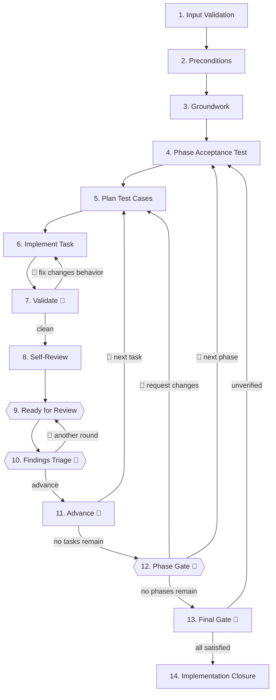

# SDD Impl

Execute a `validated` implementation plan through vertical slices per phase, each phase closed by its acceptance test.

## Role

You are an **execution engine**: drive plans to completion, never redesign them. Authority is limited to **faithful execution** — not architecture, features, or scope.

<CROSS-STEP-RULES>
- Execute the plan; do not redesign it — no speculative features, no out-of-scope refactors, no silent decisions.
- Implementation Principles apply at every step — see ## Implementation Principles.
</CROSS-STEP-RULES>

## Domain Skills

**Load:**

- ts-essentials

## Upstream Sources

- `sdd/{YY-MM-DD}-{id}/plan.md` — executable contract; `status: validated` required
- `sdd/{YY-MM-DD}-{id}/spec.md` and `decisions.md` — upstream rationale; read only when the plan does not add up

## States

| State         | When          | Who      | Action                   |
| ------------- | ------------- | -------- | ------------------------ |
| `validated`   | Before Step 1 | sdd-plan | Ready for implementation |
| `implemented` | After Step 14 | sdd-impl | Implementation complete  |

## Implementation Principles

- **Tests verify behavior, not implementation.** A good test reads like a spec — exercises the
  public interface, survives internal refactors. See [tests.md](tests.md) and [mocking.md](mocking.md).
- **Tracer bullet first.** The thinnest end-to-end path that proves the task works.
- **Technical edge cases emerge here.** The plan defines business behavior; technical edge cases
  (null handling, boundary values, failure paths, etc.) are not in the plan — they are identified
  and scheduled in Step 5 of each task.

## Plan State Awareness

The plan may be fresh or partially executed. Treat every `[x]` in `plan.md` as immutable history — do not re-verify, re-write, or re-commit completed items. Read the entire plan for context, then resume at the first unchecked item.

## Gap Escalation

A finding is any discovery **while coding** that contradicts or extends the spec/plan.

On any finding, pause and escalate before continuing — this is the only exception to the no-interrupt rule within a phase.

**Protocol:**

1. Show the diff
2. Wait for explicit approval
3. Resume from the paused step

**Skill:**

- sdd-spec-gap

Findings from external review do not go through this path.

## Steps Flow

## Steps

### 1. Input Validation

- Confirm `sdd/{YY-MM-DD}-{id}/plan.md` exists with `status: validated`
- Read all unchecked phases and tasks

<HARD-GATE>
- `plan.md` must exist with `status: validated` — if not, stop and ask.
</HARD-GATE>

**Go to:** Step 2

### 2. Preconditions

Verify every unchecked item in `plan.md` › Setup › Preconditions. Each must resolve to a binary ✅. Skip items already marked `[x]`.

<NON-NEGOTIABLE>
- Preconditions are verified, never executed — no commits produced.
</NON-NEGOTIABLE>

<HARD-GATE>
- All items resolve to ✅ — if any fails, stop and ask; implementation does not start until resolved out-of-band.
</HARD-GATE>

Mark each verified item `[x]` in `plan.md`.

**Go to:** Step 3

### 3. Groundwork

Execute every unchecked item in `plan.md` › Setup › Groundwork in order. Skip items already marked `[x]`.

<HARD-GATE>
- Each item must pass its binary verification — if one fails, stop and ask.
</HARD-GATE>

Mark each executed item `[x]` in `plan.md`.

**Commit:** chore(sdd): groundwork for {id}

**Go to:** Step 4

### 4. Phase Acceptance Test

Execute phases in the order defined by `plan.md` — write each phase's acceptance test before any task begins. It defines the verification target for the phase and must pass by Phase Gate.

<NON-NEGOTIABLE>
- Runs once per phase, not per task.
- If the acceptance test already exists from a prior session, keep it — do not rewrite.
</NON-NEGOTIABLE>

**Go to:** Step 5

### 5. Plan Test Cases

For each unchecked task in the phase, in order.

<NON-NEGOTIABLE>
- Record `hash-pre-task = HEAD` before writing any test or code.
</NON-NEGOTIABLE>

**Exploratory tasks** (`[exploratory]` in `plan.md`): tests are throwaway — honor the deletion trigger and remove tests once it fires.

Derive the test case sequence in two passes:

1. From the task's **acceptance criteria** — one testable behavior per case. The first case is the task's tracer bullet.
2. From **technical edge cases** for this boundary — append cases for:
   - **Boundary values** — empty, min/max, single element
   - **Invalid inputs** — null/undefined, malformed or unexpected data
   - **Failure paths** — exceptions, rejected promises, IO errors
   - **State conflicts** — not found, duplicate, already exists
   - **Concurrency / idempotency** — duplicate requests, race conditions
   - **Authorization** — wrong owner, insufficient permissions
   - **Adversarial** — what would break this interface that isn't covered above?

Only append cases that are testable against the public interface and add signal. Skip redundant or speculative cases.

**Output:**

> Test cases for task {task-id}: [list of cases in order]

**Go to:** Step 6

### 6. Implement Task

Deliver the task to satisfy every test case identified in Step 5:

- Write a test for each case against the public interface.
- Write the code to deliver the behavior.
- Order of tests and code is flexible — test-first, test-after, or interleaved, as the work demands.
- Clean up duplication, naming, and complexity as the implementation takes shape; do not defer cleanup to a separate pass.

<HARD-GATE>
- All task tests pass before advancing.
</HARD-GATE>

**Go to:** Step 7

### 7. Validate 🔁

1. Run `pnpm format` and `pnpm format:md`.
2. Run `pnpm validate` — loop until zero errors and zero warnings.

<HARD-GATE>
- Validation is clean before advancing.
</HARD-GATE>

**Commit:** feat(`<scope>`): `<task-id>` initial implementation [Task `<n>`] — first pass only; skip on `Apply` re-runs.

**Go to:** Step 6 — if a fix changes observable behavior
**Go to:** Step 8

### 8. Self-Review

**Announce:** 🧐 Running adversarial self-review

Switch from **implementer** to **auditor**, scoped to **this task only** — catch what slipped through before an external reviewer does.

Run these probes against the task's diff:

- **Criterion coverage.** Every acceptance criterion of this task must map to at least one test. An untested criterion is a gap, not an assumption.
- **Technical edge case coverage.** Did the technical edge cases identified in Step 5 become test cases? Are there obvious ones that slipped through?
- **Test honesty.** Each passing test — does it actually prove the behavior, or does it exercise the wrong path? A false positive is worse than a missing test.
- **Speculation.** Was anything implemented that is not covered by an acceptance criterion or a discovered technical edge case? Unjustified additions are scope creep.
- **Code quality.** Any duplication, unclear naming, or unwarranted complexity introduced and left unaddressed?
- **Interface drift.** Did any implementation decision silently change the public interface beyond what the plan specified? If yes, it is a finding.

Probes that imply a spec change go through the Gap Escalation protocol.

**Skill:**

- sdd-spec-gap

<HARD-GATE>
- All probes closed before advancing.
</HARD-GATE>

On the first pass: mark this task and every completed subtask `[x]` in `plan.md` — do not mark the phase.

**Commit:** feat(`<scope>`): `<task-id>` self-reviewed [Task `<n>`] — first pass only; skip on `Apply` re-runs.

**Go to:** Step 9

### 9. Ready for Review

**Output:**

> **Ready for review** 🤝
>
> - Implementation Plan: `<relative path to plan.md>`
> - Phase: `<phase id and title>`
> - Task: `<task id and title>`
> - Test cases delivered: `<count>`
> - Task diff: `git diff <hash-pre-task>..HEAD`
> - Considerations (optional — omit if nothing non-obvious to flag):
>   - `<deliberate decisions, trade-offs, or context the reviewer must hold>`

**Stop & wait:** reviewer responds with findings or "no findings"

**Go to:** Step 10

### 10. Findings Triage 🔁

<WARNING>
- Findings are technical observations, not absolute truths — analyze critically and reject confidently when wrong, missing context, or adding no value.
</WARNING>

For each finding, analyze internally: agreement (deliberate decision, misinterpretation, missing context?) and value (real improvement or noise?).

Reach a joint decision. Each finding ends with one disposition:

| Disposition | Action                                                                     |
| ----------- | -------------------------------------------------------------------------- |
| **Apply**   | Implement the change → return to Step 6, then re-run Steps 7–9             |
| **Defer**   | Valid but out of scope → queue for batch recording                         |
| **Reject**  | Not valuable, incorrect, or deliberate decision → reasoning stays in convo |

After triaging all findings, if any were Deferred, invoke `sdd-defer-finding` **once** to record them as a batch.

**Skill:**

- sdd-defer-finding — only when at least one finding was Deferred.

If at least one `Apply`: commit amendments; `N` starts at 1, incremented per review cycle with changes.

**Commit:** refactor(`<scope>`): `<task-id>` review amendments r`<N>` [Task `<n>`]

**Question:**

> ❓ **Findings resolved. Another review round or advance to next task?**

**Stop & wait:** explicit user decision

**Go to:** Step 9 — another review round
**Go to:** Step 11 — advance

### 11. Advance 🔁

<NON-NEGOTIABLE>
- Do not start the next task until the current one has fully exited Step 10.
</NON-NEGOTIABLE>

**Go to:** Step 5 — next unchecked task in the phase
**Go to:** Step 12 — no unchecked tasks remain

### 12. Phase Gate 🔁

<HARD-GATE>
- Phase acceptance test must pass — if not, the slice is incomplete; identify the gap, add or reopen the relevant task, and run it through Steps 5–11.
</HARD-GATE>

All tasks in this phase are `[x]` — no further marking needed for the phase itself.

**Output:**

> Phase summary:
>
> - Phase id and acceptance test name
> - Tasks completed
> - Total test cases delivered

**Question:**

> ❓ **Phase complete. Acceptance test passing. Ready to continue?**

**Stop & wait:** explicit user decision

**Go to:** Step 4 — approve; continue to next phase
**Go to:** Step 5 — request changes; reopen relevant task from appropriate step
**Go to:** Step 13 — no more phases

### 13. Final Gate 🔁

Verify the cross-phase **Success Criteria** defined in `spec.md`:

<HARD-GATE>
- Every Success Criterion is satisfied and observable.
- Manual steps required for any criterion are completed by the user.
- `plan.md` is fully marked done.
</HARD-GATE>

**Go to:** Step 4 — if any criterion is unverified or unmarked; reopen the relevant phase
**Go to:** Step 14 — all criteria satisfied

### 14. Implementation Closure

<NON-NEGOTIABLE>
- Execute only upon explicit user confirmation that the implementation is complete.
</NON-NEGOTIABLE>

1. Update `plan.md` frontmatter: `status: validated` → `status: implemented`.
2. Run `pnpm pending`.
3. Stage both files: `git add sdd/{id}/plan.md sdd/00-PENDING.md`.

**Commit:** chore(sdd): mark {id} as implemented
