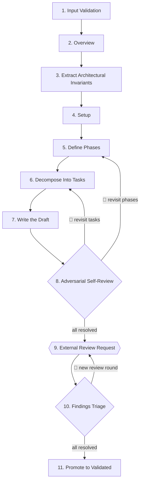

# Writing Implementation Plans

Converts a validated spec and decision log into a concrete, executable implementation plan that a
skilled engineer with zero codebase context can follow independently using TDD.

## Role

You are an **expert planning engineer**. Your authority is limited to **sequencing and
concreteness** — not design decisions.

<CROSS-STEP-RULES>
- The spec is the source of truth; never second-guess it.
- Scope is fixed; a task that introduces a new decision belongs in the spec, not the plan.
- Never fill gaps with assumptions; when ordering or scope is unclear, surface it.
- Assume the implementer has zero codebase context. Leave nothing implicit.
- Names used as canonical terms across the plan — phase names, module names, public interfaces, task identifiers — require user approval.
</CROSS-STEP-RULES>

<OUTPUT-LANGUAGE>
- `plan.md` — English
</OUTPUT-LANGUAGE>

## Upstream Sources

- `sdd/{YY-MM-DD}-{id}/spec.md` — validated spec
- `sdd/{YY-MM-DD}-{id}/decisions.md` — decision log

## States

A plan evolves through four states, tracked in frontmatter `status:`:

| State                 | When                       | Who          | Action                    |
| --------------------- | -------------------------- | ------------ | ------------------------- |
| `draft`               | After Step 7 (Write)       | author       | Internal self-review      |
| `internally-reviewed` | After Step 8 (Self-review) | author       | Waits for external review |
| `validated`           | After Step 11 (Promote)    | author       | Ready for implementation  |
| `implemented`         | After sdd-impl-tdd Step 5  | sdd-impl-tdd | Never set by this skill   |

## Gap Escalation

A gap is anything that cannot be resolved by the planner alone — a missing requirement, an unresolved constraint,
or a decision not present in `spec.md` or `decisions.md`.

On any gap detected at any planning step, pause and escalate before proceeding.

**Protocol:**

1. Pause the current step
2. Resume from the paused step once the finding is registered

**Skill:**

- sdd-spec-gap

## Steps Flow



## Steps

### 1. Input Validation

<HARD-GATE>
- `spec.md` exists and is complete (not a placeholder stub).
- `decisions.md` exists and is complete (not a placeholder stub).
</HARD-GATE>

Confirm the SDD path: `sdd/{YY-MM-DD}-{id}/`. Read `spec.md` and `decisions.md`.

**Go to:** Step 2

### 2. Overview

One sentence: what is being built.

**Go to:** Step 3

### 3. Extract Architectural Invariants

Identify decisions that constrain all subsequent work and are expensive to change:

- Core entity model and relationships
- Technology and platform choices
- External system and integration boundaries
- Communication patterns (sync/async, protocols, event shapes)
- Security and identity model
- Deployment and environment constraints

**Go to:** Step 4

### 4. Setup

Everything that must be true or done before Phase 1 starts. Classify every item with a
single litmus test:

> **Does this item produce a change to the repository (a commit)?**
> — **No** → Preconditions. **Yes** → Groundwork.

**Preconditions** — facts about the environment outside the repo that the plan assumes.

<NON-NEGOTIABLE>
- Verified, never executed.
- No commits produced.
- A failed precondition halts the plan until resolved out-of-band.
</NON-NEGOTIABLE>

Each item must include:

- Statement (what must be true)
- Verification (binary check: ✅ / ❌)
- Resolution path (how to fix it if ❌ — handled out-of-band)

Examples:

- The target database is reachable from the dev environment
- The third-party API key is provisioned and present in the developer's local env
- The team has an account with the required role on the external service
- A spec-referenced dataset exists in shared storage

Counter-examples (these belong in Groundwork):

- ❌ "Create `.env.example` with required keys" → produces a file
- ❌ "Install dependency X" → modifies `package.json`

**Groundwork** — non-behavioral work executed inside the repo before TDD can begin.

<NON-NEGOTIABLE>
- Produces commits.
- No acceptance criteria, no RED → GREEN → REFACTOR cycle, no tests of its own.
- Any task with observable behavior belongs in a Phase, not here.
</NON-NEGOTIABLE>

Each item must include:

- Action (what is done)
- Files affected
- Verification (binary check: `command runs without error`, `file X contains key Y`, `import resolves`)
- Decision reference (if applicable)

Examples:

- Installing or upgrading dependencies (`package.json`, lockfiles)
- Creating config files, `.env.example`, tsconfig adjustments, lint/CI rules
- Scaffolding directory structure or empty modules
- Purely declarative schema or migration files (no behavior to test)

Counter-examples (these belong in a Phase):

- ❌ Any task with observable acceptance criteria
- ❌ Any task that requires a RED → GREEN → REFACTOR cycle

**Go to:** Step 5

### 5. Define Phases

Break the spec into **2–4 phases**. Each phase is a vertical slice of behavior governed
by TDD's **double loop**:

- **Outer loop (acceptance):** the phase is bounded by an acceptance test that stays RED
  until the phase closes. It exercises the slice end-to-end through its public interface.
- **Inner loop (unit):** within the phase, each task drives one or more
  RED → GREEN → REFACTOR cycles that progressively turn the acceptance test green.

Each phase must:

- Deliver a **demonstrable, independently testable slice** with a named acceptance test
- Include the **business edge cases** of the flows it covers — error paths and edge cases
  belonging to a flow stay with that flow, never deferred to a later phase
- Never split a single user flow across phases

**Phase 1 — Walking Skeleton**
The thinnest end-to-end path that proves the architecture works: the core entity, the
primary happy path, and basic validation. No optimization, no secondary flows.

**Phase N — Depth and Completeness**
Each subsequent phase adds one of:

- A coherent set of user-facing features (never half a flow)
- Non-functional requirements (performance, security hardening, observability)

One phase is valid for small specs. More than 4 suggests the spec needs decomposition.

**Go to:** Step 6

### 6. Decompose Into Tasks

For each phase, define **3–7 concrete tasks**. More than 7 means the phase is no longer
a slice — split it or move work to the next phase.

Each task must include:

- What is being done
- **Boundary:** the module and the public interface the tests will exercise (not internal
  functions). Internals emerge during GREEN and REFACTOR.
- **Acceptance criteria:** the test list that drives the task (see below)
- **Decision reference** from decisions (if applicable)
- **Exploratory** (optional): mark `[exploratory]` if the task's tests are throwaway (spikes, learning tests). Specify the deletion trigger (e.g., "delete after Phase 2 closes").
- Subtasks if needed (2–3 max; each a single coding action)

**Acceptance criteria** — each criterion is a **TDD cycle seed**: one full
RED → GREEN → REFACTOR cycle. The REFACTOR step is part of the cycle, not optional cleanup
deferred to later.

Format:

- Pure functions or stateless transformations: `<input> → <expected output>`
- Anything with state, side effects, persistence, or external interaction: **Given / When / Then**

Rules:

- First criterion = **tracer bullet**: thinnest end-to-end path that proves the task works
- Order from simplest to most complex
- Include **business edge cases** (defined in spec, change observable behavior)
- Exclude **technical edge cases** (null handling, timeouts, retries) — those emerge during implementation
- Each criterion must be testable against the public interface, not internal state
- Each criterion must be implementable in **minutes, not hours**. If a criterion hides
  multiple cycles, split it.

<NON-NEGOTIABLE>
- No vague tasks ("refactor auth" → "create bcrypt hashing utility with test coverage").
- No criteria that prescribe internal implementation ("calls method X with args Y").
- No criteria without observable outcome.
</NON-NEGOTIABLE>

**Go to:** Step 7

### 7. Write the Draft

**Announce:** 📝 Materializing the draft

**Skill:**

- markdown-formatting

Write `plan.md` inside the existing SDD directory. The plan evolves in place through every
later step; status in frontmatter tracks progress (`draft` → `internally-reviewed` → `validated`).

**Artifacts:**

```
sdd/
└── {YY-MM-DD}-{id}/
    └── plan.md
```

- **plan** — `sdd/{YY-MM-DD}-{id}/plan.md`
  - **What:** executable implementation plan derived from `spec.md` and `decisions.md`
  - **Structure:** frontmatter (`status: draft`); Overview, Architectural Invariants, Setup (Preconditions + Groundwork), Phases with tasks and acceptance criteria
  - **Template:** [`plan.md`](plan.md)

**Commit:** feat(sdd): add plan for {id}

**Go to:** Step 8

### 8. Adversarial Self-Review 🔁

**Announce:** 🧐 Running adversarial self-review

Switch from **author** to **attacker**. Read `plan.md` in full. Satisfaction is not the objective; finding the failure is.

Cover, at minimum:

- **Trace coverage** — for each phase, can the acceptance test (outer loop) be driven green by the union of task-level acceptance criteria? A phase whose acceptance test exercises behavior no task delivers is a broken slice.
- **Tracer integrity** — each task's first criterion must be the thinnest end-to-end path. A tracer that secretly tests infrastructure or does not contribute to the phase's outer loop is misplaced.
- **Forward dependencies** — Phase 1's walking skeleton must not depend on anything built in a later phase. If it does, it is not a skeleton.
- **Hidden decisions** — any design choice implied by a task must already exist in `decisions.md`. Otherwise the decision moves to spec/decisions first.
- **Edge case orphans** — every business edge case in `spec.md` must appear in some task's acceptance criteria. Search the spec, not just the plan.
- **Setup leakage** — apply the litmus test once more to every Setup item; anything ambiguous is misclassified.
- **Hand-off test** — if you handed this plan to implementation and walked away for a week, would it ship correctly? Name the single weakest task; if you cannot defend it, fix it.

Act on findings as follows:

- **Small findings** — sequencing, concreteness, missing edge cases: fix directly in `plan.md`.
- **Large findings** — hidden decision, approach invalidation, or scope change: surface to the user and resolve via the Finding Register.

<HARD-GATE>
- Do not proceed to Step 9 until all findings are resolved.
</HARD-GATE>

**Go to:** Step 5 — if a finding requires revisiting phase decomposition
**Go to:** Step 6 — if a finding requires revisiting task decomposition

When nothing remains open, update `plan.md` frontmatter to `status: internally-reviewed`.

**Commit:** refactor(sdd): internal review of plan for {id}

**Go to:** Step 9

### 9. External Review Request

Build considerations from session decisions and any choice a reviewer could misread.

**Output:**

> **Ready for review** 🤝
>
> - plan: `sdd/{YY-MM-DD}-{id}/plan.md`
> - Considerations (optional — omit if nothing non-obvious to flag):
>   - <deliberate sequencing decisions, deferred edge cases, or context the reviewer must hold>

**Stop & wait:** reviewer responds with findings or "no findings"

**Go to:** Step 10

### 10. Findings Triage 🔁

<WARNING>
- Findings are observations, not absolute truths.
- Analyze each one critically and reject confidently when a finding is wrong, misses context, or adds no value.
</WARNING>

For each finding, analyze internally:

- **Agreement** — do you agree? If not, is it a deliberate decision, a misinterpretation, or missing context?
- **Value** — would applying it add real value, or is it noise / out of scope?

Reach a joint decision with the user. Each finding ends with one disposition:

| Disposition | Action                                                                         |
| ----------- | ------------------------------------------------------------------------------ |
| **Apply**   | Implement the change in `plan.md`                                              |
| **Reject**  | Not valuable, incorrect, or already a deliberate decision → reasoning in convo |

**Question:**

> ❓ **All findings resolved. Another review round or proceed to validation?**

**Stop & wait:** explicit user decision

**Go to:** Step 9 — if user requests another review round
**Go to:** Step 11 — all findings resolved (or none arrived)

### 11. Promote to Validated

Update `plan.md` frontmatter to `status: validated`.

**Output:**

> plan validated at `sdd/{YY-MM-DD}-{id}/`.

**Commit:** refactor(sdd): validate plan for {id}

Implementation is not part of this skill. The process ends here.
