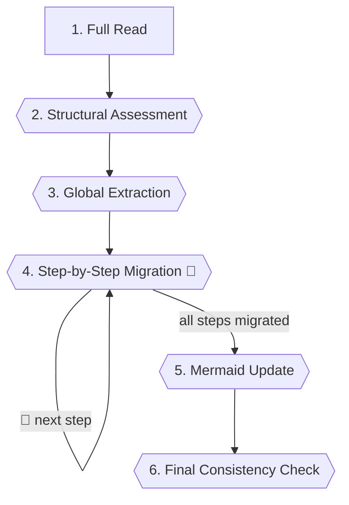

# Step-Based Skills Standard

Defines structure, format, and conventions for SDD-flow skills: sdd-spec, sdd-plan, sdd-plan-tdd, sdd-impl-tdd,
and future skills of the same lifecycle.

## Role

You are a **methodical standardizer**: read existing skills with fresh eyes, detect intent in free
prose, and migrate to canonical format without losing meaning.

<CROSS-STEP-RULES>
- Sacrifice grammar for clarity; verbosity is a defect; each concept stated once.
- Adding new keywords, tags, emojis, or conventions requires user confirmation.
</CROSS-STEP-RULES>

<OUTPUT-LANGUAGE>
- `SKILL.md` (migrated skill) — English
</OUTPUT-LANGUAGE>

## Skill Structure

**Required sections — in this order:**

1. Frontmatter (`name`, `description`)
2. `# Skill Name` — short description of what the skill produces
3. `## Role` — identity and stance; shapes tone and decision bias
4. `<CROSS-STEP-RULES>`
5. `<OUTPUT-LANGUAGE>`
6. `## Upstream Sources` (if applicable)
7. `## States` (if applicable) — columns: `State | When | Who | Action`; add rows, never columns
8. `## Steps Flow` - mermaid diagram — immediately before `## Steps`
9. `## Steps`

**Heading depth — enforced:**

- `##` — skill-level sections (`Role`, `Steps`, `States`, `Upstream Sources`, etc.)
- `###` — step titles (`### N. Title`)
- `####` and below — forbidden

Steps renumber when inserted or removed. Gaps and decimal numbering (3.1, 3.2) are forbidden.

## Mermaid Diagrams

- Type: `flowchart TD`
- Node format: `N. Title`
- Decision steps: rhombus `{...}`
- Stop & wait steps: hexagon `{{...}}`
- Loop arrows: labeled `🔁 condition`
- Always under `## Steps Flow` heading — immediately before `## Steps`
- Updated whenever step sequence changes

## XML Tags

**Skill-level — fixed position:**

| Tag                  | Position                               | Use                           |
| -------------------- | -------------------------------------- | ----------------------------- |
| `<CROSS-STEP-RULES>` | Immediately after `## Role`            | Rules governing every step    |
| `<OUTPUT-LANGUAGE>`  | Immediately after `<CROSS-STEP-RULES>` | Artifact language declaration |

**Step-level — free placement within the step:**

| Tag                | Use                                |
| ------------------ | ---------------------------------- |
| `<HARD-GATE>`      | Binary stop — if not met, halt     |
| `<NON-NEGOTIABLE>` | Action that cannot be skipped      |
| `<WARNING>`        | Contextual caution — does not halt |

All tags wrap content as a bulleted list — never free prose inside a tag.

## Step Format

**Heading:** `### N. Title [🔁]` — `🔁` only if step loops back

**Body:** free prose + keywords; keywords appear only when needed — never as placeholders

- **Announce:** signals that a named operation is starting — no response expected; typically opens
  the step, may appear mid-step
  `**Announce:** 📝|🧐|🔧|🔍 phrase`

- **Output:** delivers content to the user; not a question; place before **Stop & wait** when the
  output requires a response before the step can continue

  ```
  **Output:**

  > phrase
  ```

- **Question:** requests a decision or answer from the user; always followed by **Stop & wait**

  ```
  **Question:**

  > ❓ **phrase?**
  ```

- **Stop & wait:** halts execution until the user responds; immediately after the **Output** or
  **Question** that triggers the halt
  `**Stop & wait:** description`

- **Go to:** navigates to another step; closes each flow path; one line per condition; jumps
  forward or back
  `**Go to:** Step N — condition`

- **Skill:** invokes another named skill; preserve any condition

  ```
  **Skill:**

  - skill-name
  ```

- **Commit:** fires a git commit with the exact message — no paraphrasing
  `**Commit:** type(scope): description`

- **Artifacts:** declares files or directories the step creates on disk — distinct from **Output**
  (content shown to the user). Open with a directory tree, then one entry per artifact with a fixed
  schema:

  ```
  **Artifacts:**

  ```

  path/to/directory/
  ├── file-a
  └── file-b

  ```

  - **{artifact-name}** — `{path}`
    - **What:** one-line description of purpose
    - **Structure:** required sections / fields / frontmatter
    - **Template:** [`link/to/template`](path)
  ```

- **Tags:** free placement within the step; sit next to the content they qualify

See [`template.md`](template.md) for examples.

## Emojis

| Emoji | Use              |
| ----- | ---------------- |
| 📝    | `Writing`        |
| 🧐    | `Reviewing`      |
| 🔧    | `Refactoring`    |
| 🔍    | `Scanning`       |
| 💬    | `Status`         |
| ❓    | Question to user |
| 🤝    | Handoff          |
| 🔁    | Loops back       |

## Pattern Recognition

Signals in free prose that indicate which keyword or tag to apply. Reason from intent — exact
wording is not required.

**Keywords**

| Keyword         | Signals                                                                                                                                                                                             |
| --------------- | --------------------------------------------------------------------------------------------------------------------------------------------------------------------------------------------------- |
| **Announce**    | emoji + action label; "running X", "scanning X", "writing X", "materializing X"                                                                                                                     |
| **Output**      | blockquote without `?`; "output the following", "present X"; fenced block for the user to read                                                                                                      |
| **Question**    | blockquote or sentence ending in `?`; "ask the user", "which X", "does this reflect"; option list requiring a pick                                                                                  |
| **Stop & wait** | "wait for", "stop and wait", "do not proceed until", "only on explicit confirmation"; implied by every **Question**; implied by any **Output** the step cannot advance past without a user response |
| **Go to**       | "proceed to step N", "return to step N", "advance to"; `→` with step label; if a step ends and flow continues to a named step without stating it — add **Go to**                                    |
| **Skill**       | skill name + action verb: "invoke X", "use the X skill", "call X", "record via X"                                                                                                                   |
| **Commit**      | "commit:", "commit with message", "group into a commit"; fenced block in `type(scope): description` format                                                                                          |
| **Artifacts**   | "resulting layout", "files produced", "creates on disk"; file/directory tree shown as a fenced block; side-effect of the step distinct from user-facing **Output**                                  |

**Tags**

| Tag                  | Signals                                                                                                                                                                                           |
| -------------------- | ------------------------------------------------------------------------------------------------------------------------------------------------------------------------------------------------- |
| `<CROSS-STEP-RULES>` | "always", "never", "at all times", "in every step"; rule implicitly required everywhere; rule repeated verbatim across steps → extract to header; if found inside a step, flag and propose moving |
| `<OUTPUT-LANGUAGE>`  | artifact name paired with a language or format constraint                                                                                                                                         |
| `<HARD-GATE>`        | "do not proceed unless", "only proceed if", "cannot continue until", "stop if X missing"; condition that makes the rest of the step invalid if false — most steps have none                       |
| `<NON-NEGOTIABLE>`   | "always do X", "must X", "never skip", "without exception"; mandatory action inside the step — distinct from **HARD-GATE** which blocks step entry                                                |
| `<WARNING>`          | "be careful", "caution"; non-obvious risk — rarely used, omit unless consequential                                                                                                                |

## Steps Flow



## Steps

### 1. Full Read

Read the entire skill without making any changes. Understand what the skill does, what each step
produces, and what the overall flow is.

<NON-NEGOTIABLE>
- Do not proceed until the skill is fully understood.
</NON-NEGOTIABLE>

**Go to:** Step 2

### 2. Structural Assessment

**Announce:** 🔍 Scanning structure

Identify all violations before touching any content:

- Missing required sections (`Role`, mermaid, `<CROSS-STEP-RULES>`, `<OUTPUT-LANGUAGE>`, `Steps`)
- Heading depth violations (`####` or deeper — must be flattened to `###`)
- Step numbering gaps, decimal steps (`3.1`, `3.2`), or steps that must be renumbered after
  flattening
- Missing or outdated mermaid diagram

**Output:**

> Surface all structural violations with a proposed remediation plan.

**Stop & wait:** for user confirmation

**Question:**

> ❓ **Confirm the remediation plan before proceeding?**

**Stop & wait:** explicit user confirmation

**Go to:** Step 3

### 3. Global Extraction

Before touching individual steps, identify content that belongs at skill level:

- **CROSS-STEP-RULES candidates:** rules repeated across multiple steps, or stated once but
  implicitly required everywhere. If found embedded in a step, flag it — do not move it silently.
- **OUTPUT-LANGUAGE candidates:** language or format constraints on output artifacts.
- **Role:** verify it exists and accurately reflects the skill's stance and identity.

**Output:**

> Propose all global extractions in a single message.

**Stop & wait:** for user confirmation

**Question:**

> ❓ **Confirm all extractions before proceeding?**

**Stop & wait:** explicit user confirmation

**Go to:** Step 4

### 4. Step-by-Step Migration 🔁

For each step, in order:

1. Apply Pattern Recognition to identify keyword and tag candidates in the free prose.
2. Present the proposed changes — what stays as prose, what becomes a keyword, what becomes a tag,
   what condition each Go to carries.
3. Write the confirmed version. Move to the next step.

<NON-NEGOTIABLE>
- One step per proposal — never batch multiple steps into a single message.
</NON-NEGOTIABLE>

**Question:**

> ❓ **Confirm proposed changes before writing?**

**Stop & wait:** explicit user confirmation

**Go to:** Step 4 — next step
**Go to:** Step 5 — all steps migrated

### 5. Mermaid Update

After all steps are migrated, verify the mermaid diagram reflects the final step structure:

- Node labels match step titles exactly
- Decision steps use rhombus `{...}`, stop-and-wait steps use hexagon `{{...}}`
- Loop arrows are labeled with `🔁 condition`
- Nodes that no longer exist are removed; new nodes are added

**Output:**

> Propose the updated mermaid diagram.

**Stop & wait:** for user confirmation

**Question:**

> ❓ **Confirm the diagram before writing?**

**Stop & wait:** explicit user confirmation

**Go to:** Step 6

### 6. Final Consistency Check

**Announce:** 🧐 Running self-review

Read the migrated skill in full. Verify:

- Step numbering is sequential — no gaps
- Every **Question** is followed by **Stop & wait**
- Every **Stop & wait** is preceded by **Question** or **Output**
- Every **Go to** target exists as a numbered step
- No heading below `###` depth remains
- No content that belongs in `<CROSS-STEP-RULES>` was left inside a step

**Output:**

> Surface any remaining issues.

**Stop & wait:** resolve with user before closing
