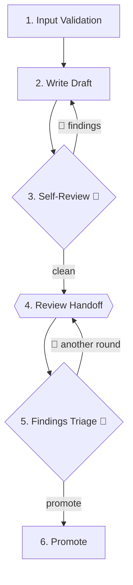

# Step-Based Skills Standard — Example

One coherent skill demonstrating every structural element. Domain kept abstract — swap `artifact` and the verbs for your own.

Content below = what a skill's `SKILL.md` looks like end-to-end.

---

```yaml
---
name: example-skill
description: "Use this skill on-demand, when explicitly invoked. Do not auto-trigger."
---
```

# Example Skill

Produces a validated `artifact` from upstream sources through a multi-step pipeline.

## Role

You are a **methodical author**. Authority limited to producing the artifact faithfully — not introducing new decisions.

<CROSS-STEP-RULES>
- Upstream sources are the source of truth; never second-guess them.
- Never fill gaps with assumptions; surface them.
- Persistent names require user approval.
</CROSS-STEP-RULES>

<OUTPUT-LANGUAGE>
- `artifact.md` — English
</OUTPUT-LANGUAGE>

## Upstream Sources

- `<path>/<input-a>.md` — scope and requirements
- `<path>/<input-b>.md` — supporting decision log

## States

| State                 | When                 | Who    | Action                    |
| --------------------- | -------------------- | ------ | ------------------------- |
| `draft`               | After Step 2 (Write) | author | Internal self-review      |
| `internally-reviewed` | After Step 3         | author | Waits for external review |
| `validated`           | After Step 6         | author | Ready for downstream use  |

## Domain Rules _(example name — use a skill-specific title)_

- Rule or behavioral constraint specific to this skill's domain.
- Another constraint that doesn't fit in `<CROSS-STEP-RULES>` (not universal across steps) but must be accessible from multiple steps.

## Steps Flow



## Steps

### 1. Input Validation

**Announce:** 🔍 Scanning upstream sources

<HARD-GATE>
- Every source listed in `## Upstream Sources` exists and is non-empty.
</HARD-GATE>

**Go to:** Step 2

### 2. Write Draft

**Announce:** 📝 Materializing the draft

<NON-NEGOTIABLE>
- Self-contained from the first write — no "TBD" sections.
</NON-NEGOTIABLE>

**Skill:**

- markdown-formatting

**Artifacts:**

```
<working-directory>/{YY-MM-DD}-{id}/
├── artifact.md
└── log.md
```

- **artifact** — `<working-directory>/{YY-MM-DD}-{id}/artifact.md`
  - **What:** primary deliverable; evolves in place across later steps
  - **Structure:** frontmatter (`status: draft`); Overview, Sections, Acceptance Criteria
  - **Template:** `[artifact.md](artifact.md)`

- **log** — `<working-directory>/{YY-MM-DD}-{id}/log.md`
  - **What:** live decision log; one entry per non-obvious choice
  - **Structure:** Decision / Alternatives / Why discarded

**Commit:** feat(artifact): add {id}

**Go to:** Step 3

### 3. Self-Review 🔁

**Announce:** 🧐 Running adversarial self-review

Switch from **author** to **attacker**. Read the artifact in full; search for the failure.

On clean review, update frontmatter to `status: internally-reviewed`.

**Go to:** Step 2 — if any finding requires revisiting the draft
**Go to:** Step 4 — clean

### 4. Review Handoff

**Output:**

> **Ready for review** 🤝
>
> - artifact: `<working-directory>/{YY-MM-DD}-{id}/artifact.md`
> - Considerations:
>   - <deliberate decisions a reviewer might misread>

**Stop & wait:** reviewer responds with findings or "no findings"

**Go to:** Step 5

### 5. Findings Triage 🔁

<WARNING>
- Findings are observations, not absolute truths. Reject when wrong, missing context, or out of scope.
</WARNING>

For each finding, reach a joint disposition with the user:

| Disposition | Action                                        |
| ----------- | --------------------------------------------- |
| **Apply**   | Implement the change in the artifact          |
| **Reject**  | Reasoning recorded in conversation; no change |

**Announce:** 🔧 Applying review amendments

**Commit:** refactor(artifact): r<N> review amendments

**Question:**

> ❓ **Findings r\<N> resolved. Another review round or promote?**

**Stop & wait:** explicit user decision

**Go to:** Step 4 — another round
**Go to:** Step 6 — promote

### 6. Promote

Update frontmatter to `status: validated`.

**Output:**

> artifact validated at `<working-directory>/{YY-MM-DD}-{id}/`.

**Commit:** refactor(artifact): validate {id}

Process ends here.

---

## Runtime-only emissions

`💬 Status` is not a step keyword — it is emitted during execution as a progress signal, never declared in step definitions.

Example emitted at runtime:

> **💬 Status:** Writing Step 2 of 6 — Write Draft
